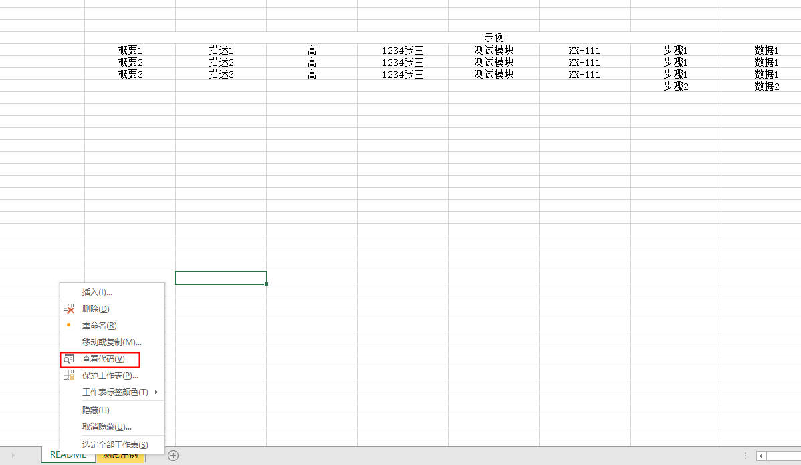

1、右键sheet表格

2、点开查看代码

3、输入：

Private Sub Worksheet_SelectionChange(ByVal Target As Range)
Cells.Interior.ColorIndex = -4142
Target.Interior.ColorIndex = 6
End Sub

数字6，代表颜色，回可以改成其答它数字

第二行也可以：Cells.Interior.ColorIndex = xlNone

这样就是表格随着鼠标移动，颜色变化

横竖随着鼠标高亮显示：代码如下：

Private Sub Worksheet_SelectionChange(ByVal Target As Range)
Cells.Interior.ColorIndex = xlNone
Target.EntireRow.Interior.ColorIndex = 24
Target.EntireColumn.Interior.ColorIndex = 24
End Sub