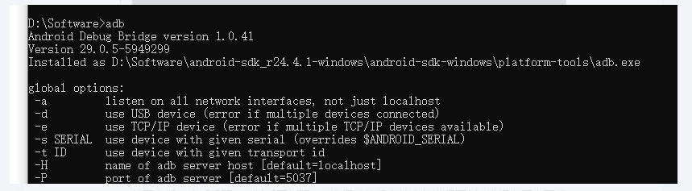
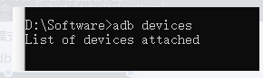
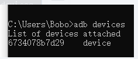
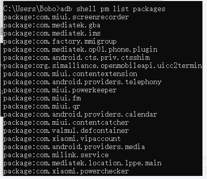

### 手机连接ADB

1、安装了sdk 

下载—解压—点击SDK Manager.exe —选择部分需要的

2.在cmd输入adb 出现以下：

3、打开手机开发者模式。自己百度
4、在cmd输入：adb devices 

，就网上找一个手机驱动，然后更新驱动，选择计算机上的文件进行更新，选择在网上下载的驱动文件目录，可能会弹出一个警告框，选择始终允许。
少了手机驱动
5、安装成功就是如下：

6、adb常用命令：
adb shell pm  list  packages    列出手机装的所有app的包名 

7、列出系统应用的所有包名：adb shell pm list packages -s
当然也可以使用 grep 来过滤：
adb shell pm list packages | grep mazhuang

8、 列出除了系统应用的第三方应用包名： adb shell pm list packages -3 
9、清除应用数据与缓存：adb shell pm clear （apk包名）（以爱奇艺为例）
10、获取正在运行的Activity：adb shell dumpsys activity activities（获取到activity可在打开应用时使用）
11.强制停止应用：adb shell am force-stop com.qiyi.video 后面跟包名  (以爱奇艺为例)
12、查看屏幕分辨率：adb shell wm size 
13、 获取手机屏幕截图并且保存到电脑
        adb shell /system/bin/screencap -p  /sdcard/screenshot.png（保存到手机SDCard，并且命名screenshot.png）
adb pull <设备里的文件路径> [电脑上的目录]
        adb pull /sdcard/screenshot.png  d:/screenshot.png（保存到电脑， d:/screenshot.png 或者 d:/bobo  电脑的路径以及目录）

adb push <电脑上的文件路径> <设备里的目录>
14、安装软件：将指定的apk文件安装到设备上
adb install <apk文件路径> 
    如: adb install com.sina.weibo 
15、卸载软件
adb  uninstall <包名>
如: adb uninstall com.sina.weibo	

adb install 内部原理简介
adb install 实际是分三步完成：
push apk 文件到 /data/local/tmp。
调用 pm install 安装。
删除 /data/local/tmp 下的对应 apk 文件。
所以，必要的时候也可以根据这个步骤，手动分步执行安装过程。

### Monkey命令

模仿人的功能操作（触屏输入、滑动输入）进行压力测试。

1.      monkey工作原理：
     a.       发送伪随机事件流，进行压力测试
     b.      遇到任何错误（crash，ANR）都会停止并报错（加参数防止停止）
2.      连接手机，获取root权限，如没有root权限，只可操作SDcard文件夹
     a.       Adb devices 查看连接设备
     b.      Adb shell 进入设备
     c.       Cd  /system/bin 进入bin目录
     d.      Ls 找到monkey
     e.      Cat monkey 查看monkey信息
     f.        Cd 退出到主目录
退出adb shell  直接输入：  exit
3.      Adb shell monkey 参数
     a.       不加参数：adb shell monkey 500 对整个系统操作500次
     b.      -p参数：adb shell monkey -p tv.danmaku.bili 500 制定程序（包名）操作
          查找程序包名：
               Adb shell pm list packages 显示所有包名
               Adb shell pmlist packages -3  显示第三方软件包名
               Adb shell pmlist packages -s  显示系统自带软件包名
     c.       -v参数：反馈信息详细程度，一般用-vv
               adb shellmonkey -p tv.danmaku.bili -vv 500
     d.      -s参数：（后加seed，seed值默认13位）
               指定伪随机数生成器的seed值，如果seed值相同，则两次monkey测试所产生的事件序列也相同。
               用于复现bug
               adb shellmonkey -p tv.danmaku.bili -vv -s 123456789 500
e.      --throttle参数：
               制定用户操作之间的时间间隔，单位是ms
               adb shellmonkey -p tv.danmaku.bili -vv -s 123456789 --throttle 300 500
              工作中最常用的300ms
f.        --ignore-crashes
            使用该参数后，当应用程序崩溃时，monkey依然继续运行；
g.       --ignore-timeouts
            使用该参数后，发生ANR错误时，monkey依然继续运行；
h.      --ignore-security-exceptions
           忽略许可错误（证书许可，网络许可）
i.        --pct-touch 60
           触摸占比60%
--pct一共9个命令
--pct {事件类型} {事件百分比}：
触摸事件百分比：--pct-touch  20（表示触摸事件为20%） --0
动作事件百分比：--pct-motion                         --1
轨迹事件百分比：--pct-trackball                      --2
基本导航事件百分比：--pct-nav                       --3
主要导航事件的百分比：--pct-majornav                --4
系统按键事件：-pct-syskeys                           --5
启动事件：-pct-appswitch                             --6
键盘翻转事件：--pct-file                             --7
其他事件的百分比：--pct-anyevent 100                --8
adb shellmonkey --pct-anyevent 50 -pct-appswitch 50 -v 500

​       完整指令：
​       adb shellmonkey  -p tv.danmaku.bili -vv  -s 123456789 --throttle 300  --ignore-crashes
​       --ignore-timeouts  --ignore-security-exceptions  --pct-touch 60 500
​       一旦执行无法中断
​             输出重定向，指定文件夹 例如 >E：\test\monkey0131.txt
​            adb shellmonkey -p com.hrbb.directbanks -vv --throttle 300 --ignore-crashes --ignore-timeouts--ignore-security-exceptions 300 >D:\1\monkey.txt
4.      检索日志
     a.       ANR traces ：保存于/data/anr/traces.txt中
     b.      重定向文件中
     c.       在log日志中检索（ctrl+F）：error、crash、anr可以查看

任何一个命令都是jar包文件
Monkey脚本存在在哪个文件夹：system/bin 最终最终是存在：system/framane
Adb shell Monkey 300  向我整个安卓手机发送300条伪随机事件流 （按键、触屏、手势输入）手机随机打开很多软件。
查找程序包名：
               Adb shell pm list packages 显示所有包名
               Adb shell pmlist packages -3  显示第三方软件包名
               Adb shell pmlist packages -s  显示系统自带软件包名
过滤包名：
Adb shell pm list packages -3 | findstr 关键词
操作其中一个APP 
Adb shell monkey  -p  包名 500  向某APP发送500条伪随机事件
Adb shell monkey  -p  包名 -v   500  向某APP发送500条伪随机事件,同时显示日志详细
一个-V 代表缺省值。仅提供启动提示，测试完成和最终结果等少量信息。
Adb shell monkey  -p  包名 -v  -v  500 
-V  越多日志信息越详细，一共要3个-v

事件百分比
0：触屏
1：滑动

-s 参数
Adb shell monkey -p  包名   -s  10   100   其中-s 10  相当于seed 值
Adb shell monkey -p   包名  -s  10   100
复现bug ，一模一样的步骤。保证两次操作序列都一模一样。如果去掉-s 10  两次伪随机事件流不一定 一样了。
例如
Adb shell monkey -p 包名 -v  -v  300  也会产生默认的seed值  加上-s 值  就是自己设定的值
  adb shell monkey -p tv.danmaku.bili -vv -s 123456789 300

--throttle参数：
               制定用户操作之间的时间间隔，单位是ms（毫秒），每次间隔0.3秒
               adb shell  monkey -p 包名 -vv -s 123456789  --throttle  300  500
           明显比只执行500变慢了。
 所有的参数必须在monkey  与  次数  之间

 --ignore-crashes
            使用该参数后，当应用程序崩溃时，monkey依然继续运行；
g.       --ignore-timeouts
            使用该参数后，发生ANR错误时，monkey依然继续运行，直至事件计数完成；
h.      --ignore-security-exceptions
           忽略许可错误（证书许可，网络许可）
i.        --pct-touch 60

​    adb shell  monkey -p 包名 -vv -s 123456789  --throttle  300 --ignore-crashes --ignore-timeouts  500

如果在整个monkey测试过程中，出现错误 会有error 、crash 、ANR 、shutdown、reboot 、

指定到一个盘里面查找错误,重定向
    adb shell monkey -p 包名 -vv -s 123456789 --throttle 300 --ignore-crashes --ignore-timeouts 500 >E:\test\monkey29.txt

