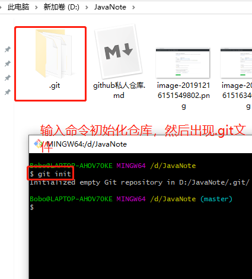
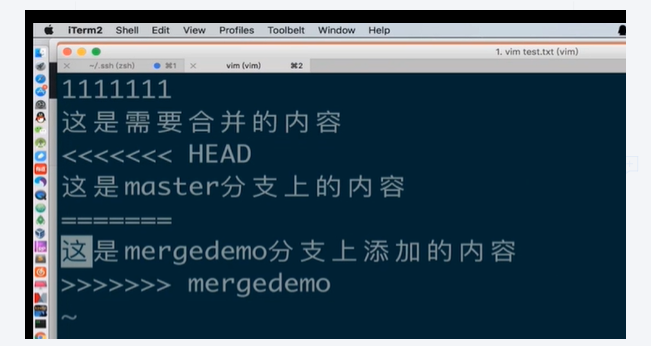

一、新建一个文件夹，
并在此文件夹目录下右键Git Base Here 进入Gitbase命令
输入git init 初始化仓库

二、或者在github远程已经新建一个仓库。然后在本地新建文件，然后右键git Bash Here，直接克隆代码；

命令：git clone URL

#### 三、github 命令使用：

1、输入git status  查看状态
怎么看呢，颜色如果还是红色，还没有提交代码，
2、增加文件：git  add  test.txt     

3、如果一下子增加很多文件：git  add .

3、增加提交注释：  git commit -m "增加测试文件"  

4、git push 推送代码

6、git pull     就是拉取代码

7、git branch   查看分支 ，git branch -a  查看远端的分支
8、git checkout -b branch1  创建branch1 分支，但是远程端还没有提交
9、git push --set-upstream origin branch1   在提交分支
10 、git checkout master  切换master分支
11、git branch  -d  branch1   删除分支branch1的分支，需要在主分支删除，只是删除本地分成
12、git branch -r -d origin/branch1       删除远程分支
 13、git push origin :branch1        把本地操作推上去。注意，冒号前要空格

##### 合并分支

1、先切换到master分支

2、输入 git merge mergedemo     这个就是合并分支
合并分支冲突  同时操作同一个文件刚好合并导致冲突类似

##### 版本汇退

查看版本号： git reflog
git  reset  --hard  1cfdc39    就是汇退到这个1cfdc39版本

然后整个git类似Linux命令操作了、
比如进入vim test.txt  ，要编辑  输入i或者o
要退出vim文件，
编辑完保存退出的四种方式
1. Esc+：+wq+回车（w是write,q是quit）
2. Esc+：+x+回车（x=wq）
3. Esc+shift+zz 
4. Esc+ZZ(在大写开启下)
如果是进入了编辑，但是未进行任何改动的保存退出命令如下：
Esc+:+q+回车

