### 1、基础知识

#### 1.1关键字

关键字的定义和特点
定义：被Java语言赋予了特殊含义，用做专门用途的字符串（单词）
特点：关键字中所有字母都为小写

| 用于定义数据类型的关键字   |           |        |        |          |
| -------------------------- | --------- | ------ | ------ | -------- |
| class                      | interface | enum   | byte   | short    |
| int                        | long      | float  | double | char     |
| boolean                    | void      |        |        |          |
| 用于定义数据类型值的关键字 |           |        |        |          |
| true                       | false     | null   |        |          |
| 用于定义流程控制的关键字   |           |        |        |          |
| if                         | else      | switch | case   | default  |
| while                      | do        | for    | break  | continue |
| return                     |           |        |        |          |

| 用于定义访问权限修饰符的关键字               |            |           |              |        |
| -------------------------------------------- | ---------- | --------- | ------------ | ------ |
| Private                                      | Protected  | Public    |              |        |
| 用于定义类，函数，变量修饰符的关键字         |            |           |              |        |
| abstract                                     | final      | static    | synchronized |        |
| 用于定义类与类之间关系的关键字               |            |           |              |        |
| extends                                      | implements |           |              |        |
| 用于定义建立实例及引用实例，判断实例的关键字 |            |           |              |        |
| new                                          | this       | super     | instanceof   |        |
| 用于异常处理的关键字                         |            |           |              |        |
| try                                          | catch      | finally   | throw        | throws |
| 用于包的关键字                               |            |           |              |        |
| package                                      | import     |           |              |        |
| 其他修饰符关键字                             |            |           |              |        |
| native                                       | strictfp   | transient | volatile     | assert |


#### 1.2保留字

Java保留字：现有Java版本尚未使用，但以后版本可能会作为关键字使用。自己命名标记符时要避免使用这些保留字 byValue、cast、future、 generic、 inner、 operator、 outer、 rest、 var 、 goto 、const


### **2、java基本语法**

#### 2.2标识符

标识符：

ØJava 对各种**变量**、**方法**和**类**等要素命名时使用的字符序列称为标识符

Ø凡是自己可以起名字的地方都叫标识符。

定义合法标识符规则：

Ø由26个英文字母大小写，0-9 ，_或 **$** 组成 

Ø数字不可以开头。

Ø不可以使用关键字和保留字，但能包含关键字和保留字。

ØJava中严格区分大小写，长度无限制。

Ø标识符不能包含空格。

注意：在起名字时，为了提高阅读性，要尽量有意义，“见名知意”。

##### 2.2.1Java中的名称命名规范

Java中的名称命名规范：
包名：多单词组成时所有字母都小写：xxxyyyzzz
类名、接口名：多单词组成时，所有单词的首字母大写：XxxYyyZzz
变量名、方法名：多单词组成时，第一个单词首字母小写，第二个单词开始每个单词首字母大写：xxxYyyZzz
常量名：所有字母都大写。多单词时每个单词用下划线连接：XXX_YYY_ZZZ

#### 2.3变量

变量的概念：
    内存中的一个存储区域
    该区域有自己的名称（变量名）和类型（数据类型）
    Java中每个变量必须先声明，后使用
   该区域的数据可以在同一类型范围内不断变化
使用变量注意：
    变量的作用域：一对{ }之间有效	
    初始化值
定义变量的格式：数据类型    变量名  =  初始化值
变量是通过使用变量名来访问这块区域的


##### 成员变量（属性）和局部变量的区别？

成员变量：
成员变量定义在类中，在整个类中都可以被访问。
成员变量分为类成员变量和实例成员变量，实例变量存在于对象所在的堆内存中。
成员变量有默认初始化值。
成员变量的权限修饰符可以根据需要，选择任意一个

局部变量：
局部变量只定义在局部范围内，如：方法内，代码块内等。
局部变量存在于栈内存中。
作用的范围结束，变量空间会自动释放。
局部变量没有默认初始化值，每次必须显式初始化。
局部变量声明时不指定权限修饰符

##### 2.3.1变量的分类-按数据类型

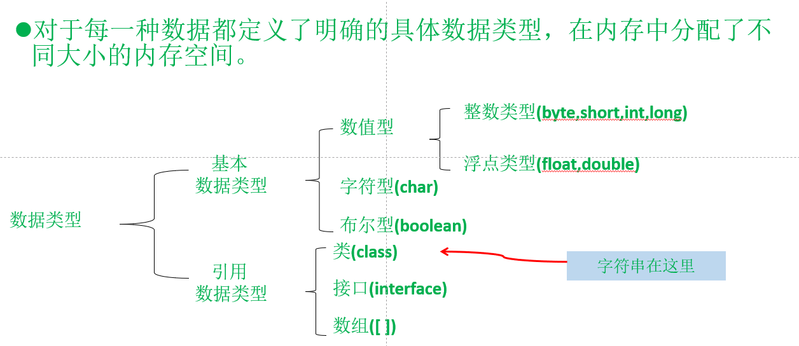

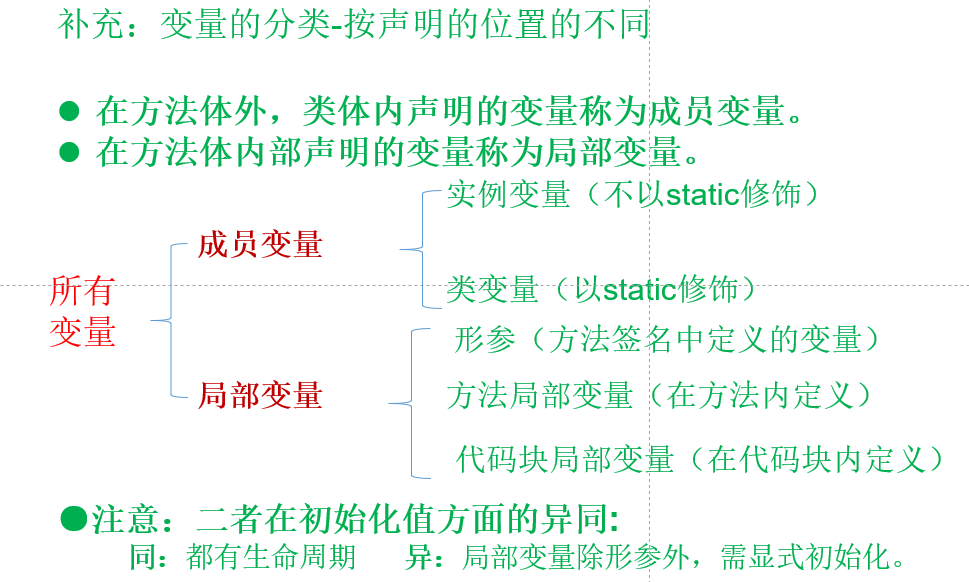

##### 2.3.2 整数类型

整数类型：byte、short、int、long
Java各整数类型有固定的表数范围和字段长度，不受具体OS的影响，以保证java程序的可移植性。
java的整型常量默认为 int 型，声明long型常量须后加‘l’或‘L’

##### 2.3.3 浮点类型

浮点类型：float、double

与整数类型类似，Java 浮点类型也有固定的表数范围和字段长度，不受具体OS的影响。
Java 的浮点型常量默认为double型，声明float型常量，须后加‘f’或‘F’。
浮点型常量有两种表示形式：
    十进制数形式：如：5.12       512.0f        .512   (必须有小数点）
    科学计数法形式:如：5.12e2      512E2     100E-2

##### 2.3.4 字符类型  char

char 型数据用来表示通常意义上“字符”(2字节)
字符型常量的三种表现形式：
字符常量是用单引号(‘ ’)括起来的单个字符，涵盖世界上所有书面语的字符。例如：char c1 = 'a';   char c2 = '中'; char c3 =  '9';
 Java中还允许使用转义字符‘\’来将其后的字符转变为特殊字符型常量。例如：char c3 = ‘\n’;  // '\n'表示换行符
直接使用 Unicode 值来表示字符型常量：‘\uXXXX’。其中，XXXX代表一个十六进制整数。如：\u000a 表示 \n。
char类型是可以进行运算的。因为它都对应有Unicode码。

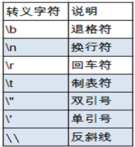

##### 2.3.5布尔类型boolean

boolean 类型适于逻辑运算，一般用于程序流程控制：
   if条件控制语句；                  
   while循环控制语句；
   do-while循环控制语句；      
   for循环控制语句；
boolean类型数据只允许取值true和false，无null。
   不可以0或非 0 的整数替代false和true，这点和C语言不同。

##### 2.3.6字符串:String类

值null可以赋值给任何引用类型（类、接口、数组）的变量，用以表示这个引用类型变量中保存的地址为空。
String类属于引用类型，可用null赋值。
String类是一个典型的不可变类，String对象创建出来就
     不可能被改变。创建出的字符串将存放在数据区，保证
     每个字符串常量只有一个，不会产生多个副本。
      String s0 = “hello”;
      String s1 = “hello”;
      String s2 = “he” + “ll”+”o”;
      System.out.println(s0 ==s1);
      System.out.println(s0 ==s2);


String s3 = new String(“hello”);又如何理解呢？


##### 2.3.7基本数据类型转换

自动类型转换：容量小的类型自动转换为容量大的数据类型。数据类型按容量大小排序为： 

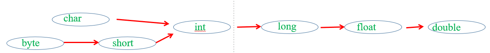

有多种类型的数据混合运算时，系统首先自动将所有数据转换成容量最大的那种数据类型，然后再进行计算。      
byte,short,char之间不会相互转换，他们三者在计算时首先转换为int类型。
当把任何基本类型的值和字符串值进行连接运算时(+)，基本类型的值将自动转化为字符串类型。 

#### 2.4运算符

##### 2.4.1 算术运算符

| **运算符**       | **运算**                                           | **范例**                 | **结果**         |
| ---------------- | -------------------------------------------------- | ------------------------ | ---------------- |
| **+**            | 正号                                               | +3                       | 3                |
| **-**            | 负号                                               | b=4;  -b                 | -4               |
| **+**            | 加                                                 | 5+5                      | 10               |
| **-**            | 减                                                 | 6-4                      | 2                |
| *****            | 乘                                                 | 3*4                      | 12               |
| **/**            | 除                                                 | 5/5                      | 1                |
| **%**            | 取模  (余数)                                       | 7%5                      | 2                |
| **++**  **++**   | 自增（前）：先运算后取值  自增（后）：先取值后运算 | a=2;b=++a;  a=2;b=a++;   | a=3;b=3  a=3;b=2 |
| **- -**  **- -** | 自减（前）：先运算后取值  自减（后）：先取值后运算 | a=2;b=-  -a  a=2;b=a-  - | a=1;b=1  a=1;b=2 |
| **+**            | 字符串相加                                         | “He”+”llo”               | “Hello”          |


注意问题

如果对负数取模，可以把模数负号忽略不记，如：5%-2=1。 但被模数是负数则不可忽略。此外，取模运算的结果不一定总是整数。

对于除号“/”，它的整数除和小数除是有区别的：整数之间做除法时，只保留整数部分而舍弃小数部分。 
      例如：int x=3510;x=x/1000*1000;  x的结果是？

“+”除字符串相加功能外，还能把非字符串转换成字符串.例如：System.out.println("5+5="+5+5); //打印结果是？5+5=55

以下二者的区别：
System.out.println('*' + '\t' +'*');
System.out.println("*" + '\t' +'*');


### **5、面向对象**

#### 5.1  面向对象与面向过程

Ø**属 性**：对应类中的成员变量

Ø**行 为**：对应类中的成员方法

Field = 属性 = 成员变量，Method =  (成员)方法 = 函数

`修饰符 class  类名 {`
	`属性声明;`	
	`方法声明;`
`}`
`说明：修饰符public：类可以被任意访问`
	`类的正文要用{  }括起来`
`举例：`
	`public class  Person{`
    `public int age ;	            //声明公有变量 age`
    `public void showAge() { //声明方法showAge( )`
	 `System.out.println(age);`
    `}`
`}`

创建java自定义类

步骤：

定义类（考虑修饰符、类名）
编写类的属性（考虑修饰符、属性类型、属性名、初始化值）
编写类的方法（考虑修饰符、返回值类型、方法名、形参等）

5.2  java语言的基本元素：类和对象

5.3  类的成员之一：属 性

5.4  类的成员之二：方 法

#### 5.5  对象的创建和使用

java类以及类的成员   （如何使用java类）   java类的实例化，即创建类的对象

1、使用new +构造器创建一个新的对象；

2、使用“对象名.对象成员”的方式访问对象成员（包括属性和方法）；

`public class Animal {  
  public int legs;	    
  public void  eat(){`
    `System.out.println(“Eating.”);`
  `}`
  `public viod move(){`
      `System.out.println(“Move.”);`
  `}`
`}`

下面创建对象，使用

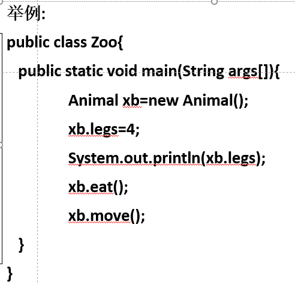

#### 5.3  类的成员之一：属 性

语法格式：
修饰符  类型  属性名 =初值 ; 
说明:修饰符private:该属性只能由该类的方法访问。
	        修饰符public:该属性可以被该类以外的方法访问。    
                    类型：任何基本类型，如int、boolean或任何类。

举例：
     public class Person{
           private int age;             //声明private变量 age
           public String name = “Lila”;    //声明public变量 name
      }

##### 5.3.1成员变量（属性）和局部变量的区别？

成员变量：
成员变量定义在类中，在整个类中都可以被访问。
成员变量分为类成员变量和实例成员变量，实例变量存在于对象所在的堆内存中。
成员变量有默认初始化值。
成员变量的权限修饰符可以根据需要，选择任意一个

局部变量：
局部变量只定义在局部范围内，如：方法内，代码块内等。
局部变量存在于栈内存中。
作用的范围结束，变量空间会自动释放。
局部变量没有默认初始化值，每次必须显式初始化。
局部变量声明时不指定权限修饰符

#### 5.4  类的成员之二：方 法

语法格式：
 	修饰符  返回值类型  方法名 ( 参数列表) {
  	 方法体语句；
} 
说明： 修饰符：public, private, protected等。
	返回值类型：return语句传递返回值。没有返回值：void。
`举例：`
	`public class Person{`
    `private int age;`
    `public int getAge()  { return age; } //声明方法getAge`
    `public void setAge(int i) {          //声明方法setAge`
	  `age = i;        //将参数i的值赋给类的成员变量age`
    `}`
`}`

#### 5.6  再谈方法

##### 5.6.1什么是方法（函数）？

方法是类或对象行为特征的抽象，也称为函数。 
Java里的方法不能独立存在，所有的方法必须定义在类里。                  

`修饰符 返回值类型 方法名（参数类型 形参1，参数类型 形参2，….）｛`

  `程序代码`
  `return 返回值;`
`｝`

其中：
形式参数：在方法被调用时用于接收外部传入的数据的变量。
参数类型：就是该形式参数的数据类型。
返回值：方法在执行完毕后返还给调用它的程序的数据。
返回值类型：方法要返回的结果的数据类型。
实参：调用方法时实际传给函数形式参数的数据。

如何理解方法返回值类型为void的情况 ?

##### 5.6.2方法的调用

 方法只有被调用才会被执行

 方法调用的过程分析

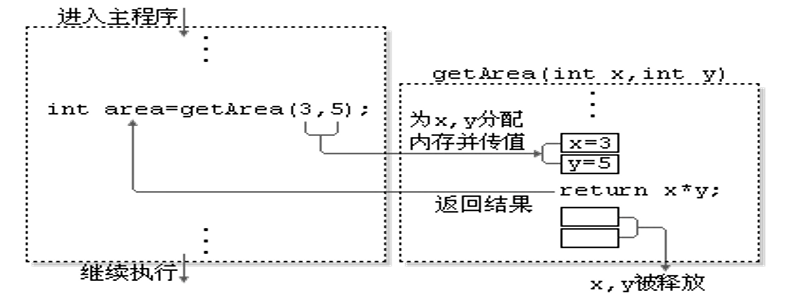

注 意：

没有具体返回值的情况，返回值类型用关键字void表示，那么该函数中的return语句如果在最后一行可以省略不写。

定义方法时，方法的结果应该返回给调用者，交由调用者处理。

方法中只能调用方法，不可以在方法内部定义方法。

##### 5.6.3对象的产生

当一个对象被创建时，会对其中各种类型的成员变量自动进行初始化赋值。除了基本数据类型之外的变量类型都是引用类型，如上面的Person及前面讲过的数组。 

| **成员变量类型** | **初始值**         |
| ---------------- | ------------------ |
| byte             | 0                  |
| short            | 0                  |
| int              | 0                  |
| long             | 0L                 |
| float            | 0.0F               |
| double           | 0.0D               |
| char             | ‘\u0000’(表示为空) |
| boolean          | false              |
| 引用类型         | null               |

##### 5.6.4匿名对象

我们也可以不定义对象的句柄，而直接调用这个对象的方法。这样的对象叫做匿名对象。
如：new Person().shout(); 

使用情况
如果对一个对象只需要进行一次方法调用，那么就可以使用匿名对象。 
我们经常将匿名对象作为实参传递给一个方法调用。 

##### 5.6.5类的访问机制：

在一个类中的访问机制：类中的方法可以直接访问类中的成员变量。（例外：static方法访问非static的成员变量，编译不通过。）

在不同类中的访问机制：先创建要访问类的对象，再用对象访问类中定义的成员。

5.6.6方法的重载

| **重载的概念**                                               |
| :----------------------------------------------------------- |
| 在同一个类中，允许存在一个以上的同名方法，只要它们的参数个数或者参数类型不同即可。 |
| 重载的特点：                                                 |
| 与返回值类型无关，只看参数列表，且参数列表必须不同。(参数个数或参数类型)。调用时，根据方法参数列表的不同来区别。 |
| 重载示例：                                                   |
| //返回两个整数的和  <br/> int add(int x,int  y){return x+y;} <br/> //返回三个整数的和   <br/> int add(int x,int y,int z){return x+y+z;}  <br/> //返回两个小数的和   <br/> double add(double x,double y){return x+y;} |

##### 5.6.7方法的参数传递

方法，必须有其所在类或对象调用才有意义。若方法含有参数：
   形参：方法声明时的参数
   实参：方法调用时实际传给形参的参数值

Java的实参值如何传入方法呢？
        Java里方法的参数传递方式只有一种：值传递。  即将实际参数值的副本（复制品）传入方法内，而参数本身不受影响。

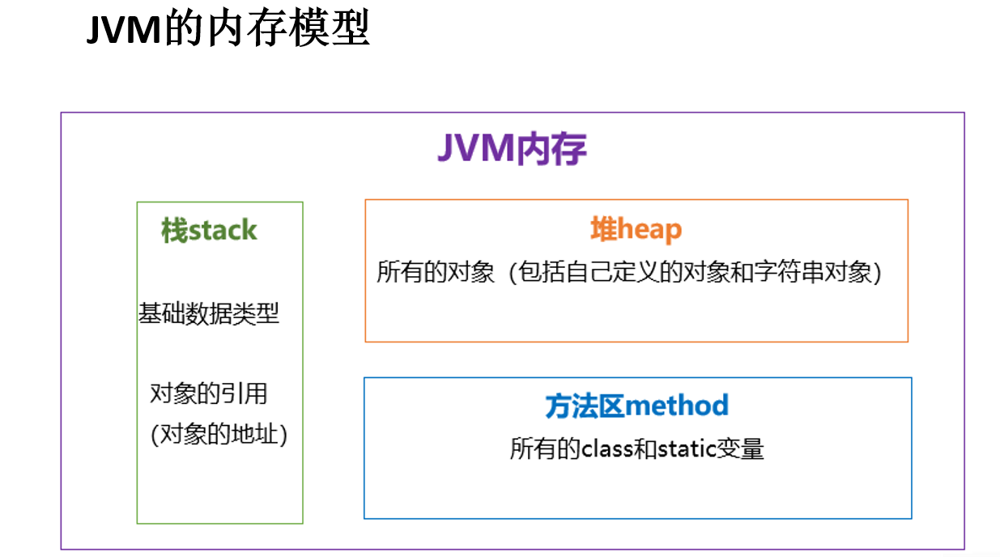

举例：方法的参数传递

`public class TestTransfer {`

 `public static void swap(int a , int b){`

 `int tmp = a;`

 `a = b;`

 `b = tmp;`

 `System.out.println("swap方法里，a的值是"`  + a + "；b的值是" + b); `}`

 `public static void main(String[] args) {`

 `int a = 6;`

 `int b = 9;`

 `swap(a , b);`

 `System.out.println("交换结束后，变量a的值是"` a + "；变量b的值是"+b);`} `

`}`

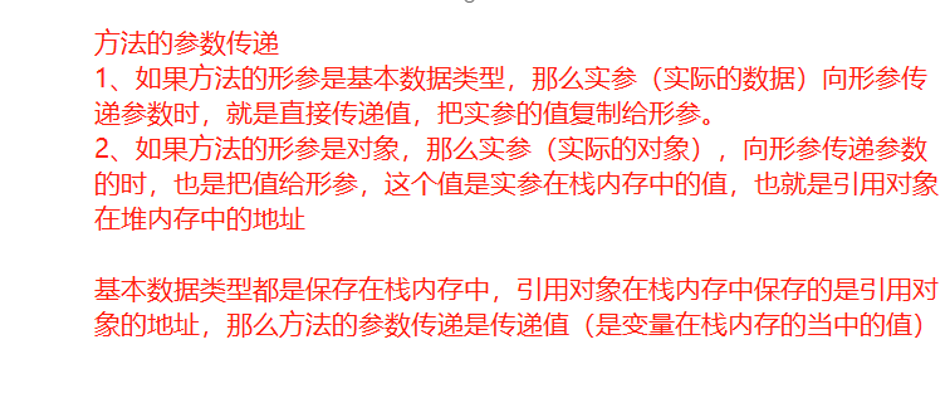


#### 5.7  面向对象特征之一：封装和隐藏

信息的封装和隐藏 

public class Animal{
	private int legs;//将属性legs定义为private，只能被Animal类内部访问
	public void setLegs(int i){  //在这里定义方法 eat() 和 move() 
		if (i != 0 && i != 2 && i != 4){
		     System.out.println("Wrong number of legs!");
		     return;
		}
		legs=i;
	}
	public int getLegs(){
		return legs;
	}  }
public class Zoo{
	public static void main(String args[]){
		Animal xb=new Animal();
		xb.setLegs(4);	  //xb.setLegs(-1000);       
        		 xb.legs=-1000;	  //非法
		System.out.println(xb.getLegs());
    }  }

四种访问权限修饰符

Java权限修饰符public、protected、private置于**类的成员**定义前，用来限定对象对该类成员的访问权限。

| **修饰符** | **类内部** | **同一个包** | **子类** | **任何地方** |
| ---------- | ---------- | ------------ | -------- | ------------ |
| private    | Yes        |              |          |              |
| (缺省)     | Yes        | Yes          |          |              |
| protected  | Yes        | Yes          | Yes      |              |
| public     | Yes        | Yes          | Yes      | Yes          |

对于class的权限修饰只可以用public和default(缺省)。

Øpublic类可以在任意地方被访问。

Ødefault类只可以被同一个包内部的类访问。

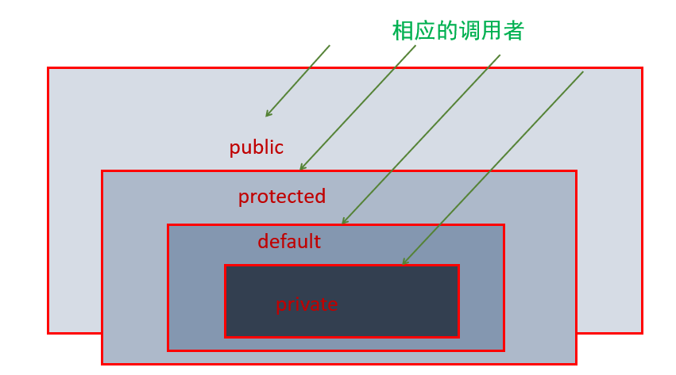

#### 5.8  类的成员之三：构造器（构造方法）

##### **构造器的特征**

Ø它具有与类相同的名称

Ø它不声明返回值类型。（与声明为void不同）

Ø不能被static、final、synchronized、abstract、native修饰，不能有return语句返回值


##### **构造器的作用**：**创建对象；给对象进行初始化**

Ø如：Order o = new Order();  Person p = new Person(Peter,15);

Ø如同我们规定每个“人”一出生就必须先洗澡，我们就可以在“人”的构造方法中加入完成“洗澡”的程序代码，于是每个“人”一出生就会自动完成“洗澡”，程序就不必再在每个人刚出生时一个一个地告诉他们要“洗澡”了。

##### **语法格式：**

**修饰符** **类名** **(**参数列表) {

   **初始化语句；**

**}** 

**l举 例：**

**public class Animal {**

**private int legs;**

**public Animal() {legs = 4; }   //**构造器

**public void setLegs**(int  i**) { legs =** i; }

**public int getLegs**(){return legs;}

}

##### 构造器

**创建**Animal类的实例：Animal a=new Animal();

**//**调用构造器，将legs初始化为4。

l根据参数不同，构造器可以分为如下两类：

Ø隐式无参构造器（系统默认提供）

Ø显式定义一个或多个构造器（无参、有参）

注 意：

ØJava语言中，每个类都至少有一个构造器

Ø默认构造器的修饰符与所属类的修饰符一致

Ø一旦显式定义了构造器，则系统不再提供默认构造器

Ø一个类可以创建多个重载的构造器

Ø父类的构造器不可被子类继承

#### 5.9  几个关键字：super、this、package、import

##### **this**是什么？

1、在java中，this关键字比较难理解，它的作用和其词义很接近。

Ø它在方法内部使用，即这个方法所属对象的引用；

Ø它在构造器内部使用，表示该构造器正在初始化的对象。

2、this表示当前对象，可以调用类的属性、方法和构造器

3、什么时候使用this关键字呢？

Ø当在方法内需要用到调用该方法的对象时，就用this。

##### 举例 

##### **使用**this**，调用属性、方法**

  1.当形参与成员变量重名时，如果在方法内部需要使用成员变量，必须添加this来表明该变量时类成

​    2.在任意方法内，如果使用当前类的成员变量或成员方法可以在其前面添加this，增强程序的阅读性

`class Person{ // 定义Person类`

 `private String name ;` 

 `private int age ;` 

 `public Person(String name,int age){` 

 `this.name = name ;`  

 `this.age = age ; }`

 `public void getInfo(){` 

 `System.out.println("姓名：" + name) ;`

 `this.speak();`

 `}`

 `public void speak(){`

 `System.out.println(“年龄：” + this.age);` 

 `}`

`}`

**使用**this调用本类的构造器

3.this可以作为一个类中，构造器相互调用的特殊格式

`class Person{ // 定义Person类`

 `private String name ;` 

 `private int age ;` 

 `public Person(){  // 无参构造`

 `System.out.println("新对象实例化") ;`

 `}`

 `public Person(String name){`

 `this();   // 调用本类中的无参构造方法`

 `this.name = name ;` 

 `}`

 `public Person(String name,int age){` 

 `this(name) ; // 调用有一个参数的构造方法`

 `this.age = age;`

 `}`

 `public String getInfo(){` 

 `return "姓名：" + name + "，年龄：" + age ;`

 `} }`

**注意：**


1.使用this()必须放在构造器的首行！


**2.**使用this调用本类中其他的构造器，保证至少有一个构造器是不用this。


**JavaBean**

1、JavaBean是一种Java语言写成的可重用组件。

2、所谓javaBean，是指符合如下标准的Java类：

Ø类是公共的

Ø有一个无参的公共的构造器

Ø有属性，且有对应的get、set方法

3、用户可以使用JavaBean将功能、处理、值、数据库访问和其他任何可以用java代码创造的对象进行打包，并且其他的开发者可以通过内部的JSP页面、Servlet、其他JavaBean、applet程序或者应用来使用这些对象。用户可以认为JavaBean提供了一种随时随地的复制和粘贴的功能，而不用关心任何改变。


### 6、IO流

**java.io.File**类的使用

**IO**原理及流的分类

**文件流**

  **FileInputStream** **/** **FileOutputStream** **/** **FileReader** **/** **FileWriter**

**缓冲流**

  **BufferedInputStream** **/** **BufferedOutputStream** **/** 

  **BufferedReader** **/** **BufferedWriter**

**转换流**

   **InputStreamReader** **/** **OutputStreamWriter**

**标准输入**/输出流

**打印流（了解）**

   **PrintStream** **/** **PrintWriter**

**数据流（了解）**

  **DataInputStream** **/** **DataOutputStream**

**对象流**  **----**涉及序列化、反序列化

  **ObjectInputStream** **/** **ObjectOutputStream**

**随机存取文件流**

  **RandomAccessFile**


#### **6.1、File** 类

File 类代表与平台无关的文件和目录。
File  能新建、删除、重命名文件和目录，但 File 不能访问文件内容本身。如果需要访问文件内容本身，则需要使用输入/输出流。

{  
    //   String pathName ="E:\\自考\\java"; 

    File f1 =new File("E:\\自考\\java\\t1.txt");        System.out.println(f1.exists());//判断文件或者文件夹是否存在，不存在是false       
    if(!f1.exists()){           
    try{ 
    f1.createNewFile();}
    catch (IOException e){               e.printStackTrace();
    } /*这个是判断如果不存在，就是新建这个f1对象的t1.txt 文件*/            } 
  
   f1.delete(); //删除这个文件；        
   File f2 =new File("E:\\自考\\java\\File");
   f2.mkdir(); //就是创建目录，但是是单层创建的，要创建多个多层目录，需要用mkdirs       
    File f3 =new File("E:\\自考\\java\\File\\duo\\duo1");        f3.mkdirs();    
    File f4 =new File("E:\\自考");        
    String[] fL=f4.list();//用数组的方式存起来，因为结果是String ，然后再用foreach 循环遍历。        
    for(String s:fL) {//定义String类型的变量s ，然后冒号后面跟着就是变量的集合            
        System.out.println(s);        
    }  
//因此list（） 返回的是当前文件夹的子集的名称，包括目录和文件        /*listFiles 则是返回当前文件夹的子集的File对象，包含目录和文件的路径*/     
    File[] fs=f4.listFiles();        
        for(File ff:fs){            
            System.out.println(ff);        
        }
```


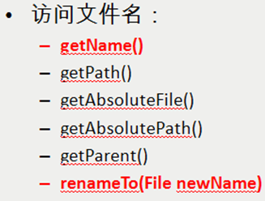


```java
System.out.println(f1.getName());//获取文件名称        System.out.println(f1.getPath());//获取当前文件的路径,就是new File时候写的绝对路径。        
File f5 =new File("java/file5.txt");//相对路径的来创建File对象，但是使用getAbsolutePath()会补全路径        System.out.println(f5.getAbsolutePath());//补全当前f5 的文件的路径，但是仅限当前D盘这个项目的；        
System.out.println(f5);       System.out.println(f5.getAbsoluteFile());//返回一个用当期的文件的绝对路径构建的File对象        System.out.println(f5.getParent());//返回当前文件夹的父级路径； 
File f6 =new File("E:\\自考\\java\\File\\a1.txt");        f6.renameTo(new File("E:\\自考\\java\\File\\t1.txt"));//给文件或文件夹重命名
```


```java
File f6 =new File("E:\\自考\\java\\File2");        System.out.println(f6.exists());        File f7 =new File("E:\\自考\\java\\File\\t1.txt");        System.out.println(f7.canRead());//可读，true        System.out.println(f7.canWrite());//可写，true        System.out.println(f7.isFile());//判断当前的File对象是不是文件 System.out.println(f7.isDirectory());//判断当前的File对象是不是文件夹/目录     //   System.out.println(f7.setLastModified());//获取文件的最后修改的时间，返回一个毫秒数        
System.out.println(f7.length());//返回文件的长度，单位字节数*/
/*遍历D盘下的test文件，把test文件所有文件、目录都遍历出来，不论层级有多深，要全部遍历处理*这个需要使用递归的方式，来实现** *//**/        /*递归遍历*/      
File file =new File("D:");
public void test(File file){  
    if(file.isFile){  
        System.out.println(file)
    }else(){}
```


iO流用来处理设备之间的数据传输。

 Java程序中，对于数据的输入/输出操作以”流(stream)” 的方式进行。

 java.io包下提供了各种“流”类和接口，用以获取不同种类的数据，并通过标准的方法输入或输出数据。 

输入input：读取外部数据（磁盘、光盘等存储设备的数据）到程序（内存）中。

 输出output：将程序（内存）数据输出到磁盘、光盘等存储设备中

#### 6.2、流的分类

  按操作**数据单位**不同分为：**字节流**(8 bit)，字符流(16 bit)

  按数据流的**流向**不同分为：**输入流，输出流**

  按流的**角色**的不同分为：**节点流，处理流**

| **(**抽象基类) | **字节流**       | **字符流** |
| -------------- | ---------------- | ---------- |
| **输入流**     | **InputStream**  | **Reader** |
| **输出流**     | **OutputStream** | **Writer** |

Java的IO流共涉及40多个类，实际上非常规则，都是从如下4个抽象基类派生的。
由这四个类派生出来的子类名称都是以其父类名作为子类名后缀。


#### 6.3、IO 流体系

输入就是读取文件，输出就是把内容输出到一个文档

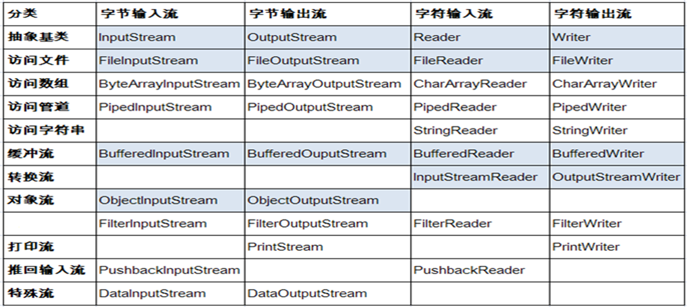

例子：字节输入输出例子

	public class Test1 {
		public static void main(String[] args) {
	//		Test1.testFileInputStream();
	//		Test1.testFileOutputStream();
	//Test1.copyFile("D:/test/abc/tt1.txt","D:/test/abc/cc/tt1.txt");		Test1.copyFile("D:/test/abc/img.png","D:/test/abc/cc/img.png");
		}
	`public class Test1 {`
		`public static void main(String[] args) {`
	`//		Test1.testFileInputStream();`
	`//		Test1.testFileOutputStream();`
	`//Test1.copyFile("D:/test/abc/tt1.txt","D:/test/abc/cc/tt1.txt");`		`Test1.copyFile("D:/test/abc/img.png","D:/test/abc/cc/img.png");`
		`}`
	/**
	 * 文件字节输入流FileInputStream
	 * 。
	 *  在读取文件时，必须保证该文件已存在，否则出异常
	 */
	public static void testFileInputStream(){
		try {
			FileInputStream in = new FileInputStream("D:/test/abc/tt1.txt");
			
			byte[] b = new byte[10];//设置一个byte数组接收读取的文件的内容
			
			int len = 0;//设置一个读取数据的长度
	`//			in.read(b);//in.read方法有一个返回值，返回值是读取的数据的长度，如果读取到最后一个数据，还会向后读一个，这个时候返回值就是-1`
				`//也就意味着当in.read的返回值是-1的时候整个文件就读取完毕了`		


	    while((len = in.read(b)) != -1){
				System.out.println(new String(b,0,len));
				//new String(b,0,len),参数1是缓冲数据的数组，参数2是从数组的那个位置开始转化字符串，参数3是总共转化几个字节
			}
			
			in.close();//注意。流在使用完毕之后一段要关闭
		} catch (Exception e) {
			e.printStackTrace();
		}
	}
	
	/**
	 * 文件字节输出流FileOutputStream
	 * 在写入一个文件时，如果目录下有同名文件将被覆盖
	 */
	public static void testFileOutputStream(){
		try {
			FileOutputStream out = new FileOutputStream("D:/test/abc/tt4.txt");//指定行tt4输出数据
			String str = "knsasjadkajsdkjsa";
			out.write(str.getBytes());//把数据写到内存
			out.flush();//把内存中的数据刷写到硬盘
			out.close();//关闭流		

```java
	} catch (Exception e) {
		e.printStackTrace();
	}
}

/**
 * 复制文件到指定位置
 * @param inPath 源文件路径
 * @param outPanth 复制到的文件夹位置
 */
public static void copyFile(String inPath, String outPanth){
	try {
		FileInputStream in = new FileInputStream(inPath);//读取的源文件
		
		FileOutputStream out = new FileOutputStream(outPanth);//复制到哪里
		
		byte[] b = new byte[100];
		
		int len = 0;
		
		while((len = in.read(b)) != -1){
			out.write(b, 0, len);//参数1是写的缓冲数组，参数2是从数组的那个位置开始，参数3是获取的数组的总长度
		}
		
		out.flush();//把写到内存的数据刷到硬盘
		out.close();
		in.close();
		
	} catch (Exception e) {
		e.printStackTrace();
	}
}
}
```


例子：复制文件

```java
   /*一个文件复制应用程序，将某个文件的内容全部复制另一个文件。 */
import java.io.*;
class input{
    public static void main(String arg[]){
    File inputFile = new File("E:\\自考\\java\\file1.txt");//创建一个输入流的文件对象，也就是这个文件作为输入的对象，这个是必须存在的
    File outputFile = new File("E:\\自考\\java\\file5.txt");//创建一个输出流的文件对象，也就是这个输出的保存对象，如果没有这个对象，会自动创建
//    int ch;
    try{
        FileReader in = new FileReader(inputFile);// 创建读的对象
        FileWriter out = new FileWriter(outputFile);//创建写入的对象
   System.out.println("文件复制程序开始工作");
    int ch;
    while((ch =in.read())!=-1){
        out.write(ch);    } //-1 是read()的读到了尾部的意思

    in.close();
    out.close();
    System.out.println("文件复制程序工作结束");
}catch(FileNotFoundException e1){
    System.out.println("文件没有找到"+e1);
}catch(IOException e2){
    System.out.println("File read Error:"+e2);
}
}
}
```


例子：标准输入和输出

`/**`

 * `标准输入和输出流`
 * `@author lby`
 `*`
 `*/`
`public class Test3 {`
	`public static void main(String[] args) {`
		`try {`
`//			Test3.testSystemIn();`
			`Test3.write2TXT();`
		`} catch (Exception e) {`
			`e.printStackTrace();`
		`}`
	`}`
	
	`/**`
	 * `标准的输入流`
	 * `@throws Exception`
	 `*/`
	`public static void testSystemIn() throws Exception{`
		`//创建一个接收键盘输入数据的输入流`
		`InputStreamReader is = new InputStreamReader(System.in);`
		
		`//把输入流放到缓冲流里`
		`BufferedReader br = new BufferedReader(is);`
		
		`String str = "";//定义一个临时接收数据的字符串`
		
		`while((str = br.readLine()) != null){`
			`System.out.println(str);`
		`}`
		
		`br.close();`
		`is.close();`
	`}`
	
	
	`/**`
	 * `把控制台输入的内容写到指定的TXT文件中，当接收到字符串over，就结束程序的运行`
	 `*/`
	`public static void write2TXT() throws Exception{`
		`//创建一个接收键盘输入数据的输入流`
		`InputStreamReader is = new InputStreamReader(System.in);`
		
		`//把输入流放到缓冲流里`
		`BufferedReader br = new BufferedReader(is);`
		
		`BufferedWriter out = new BufferedWriter(new FileWriter("D:\\testdemo\\demo\\src\\day13\\tt7.txt"));`
		
		`String line = "";`
		
		`while((line = br.readLine()) != null){`
			`if(line.equals("over")){`
				`break;`
			`}`
			`//读取的每一行都写到指定的TXT文件`
			`out.write(line);`
		`}`
		
		`out.flush();`
		`out.close();`
		`br.close();`
		`is.close();`
		
	
	`}`
	
	
	

`}`


### 7、集合

List , Set, Map都是接口，前两个继承至Collection接口，Map为独立接口
Set下有HashSet，LinkedHashSet，TreeSet
List下有ArrayList，Vector，LinkedList
Map下有Hashtable，LinkedHashMap，HashMap，TreeMap
Collection接口下还有个Queue接口，有PriorityQueue类

　Java集合类存放于 java.util 包中，是一个用来存放对象的容器。

注意：①、集合只能存放对象。比如你存一个 int 型数据 1放入集合中，其实它是自动转换成 Integer 类后存入的，Java中每一种基本类型都有对应的引用类型。

　　　②、集合存放的是多个对象的引用，对象本身还是放在堆内存中。

　　　③、集合可以存放不同类型，不限数量的数据类型。


```java
public class JiHeTest01 {
    public static void main(String[] args){

//       Set set=new HashSet();//集合对象
        Set<Object> set=new HashSet<Object>();//与上面的等价，指定Object对象，因为现在所有的类型都是自动转成Object对象
/*   set.add(1);
    set.add("a");
    set.add("b");//增加一个数据/元素
    System.out.println(set);//输出两个集合[1, a]

    set.remove(1);//移除数据；
    System.out.println(set);

    System.out.println(set.contains("a"));//判断有没有这个值

    set.clear();//清空集合
    System.out.println(set);
    */
```


```java
    set.add("a");
    set.add("b");
    set.add("c");
    set.add("d");
    //如何遍历，使用迭代器遍历
    Iterator it=set.iterator();
    while (it.hasNext()){
        System.out.println(it.next());
    }
    //如何遍历，foreach 迭代  好
    for (Object obj:set){ //因为不知道集合有什么，先定一个对象和变量，加上冒号：集合
        //先把set集合的每一个数据取出来，赋值给obj，然后再遍历，直到循环set的所有值
        System.out.println(obj);

        //集合的大小怎知？ 获取元素个数，

        // 即便添加多一个"d"，但是不会增加多一个元素。也就是不可重复，但是可以存null，但是放在set集合的第一个位置，
        set.add(null);
        System.out.println(set.size());

        //set 集合里面可以存不同的对象。但是如果只要集合只能存同样的对象（集合存对象）
        //            ----使用泛型，在集合前面使用<>,里面是类型
            Set<String> set1 =new HashSet<String>();//这个就是泛型,指定String为集合的泛型，不能存其他类型了
            set1.add("abc");
//            set1.add(1);  报错

        }


    }

}
```


