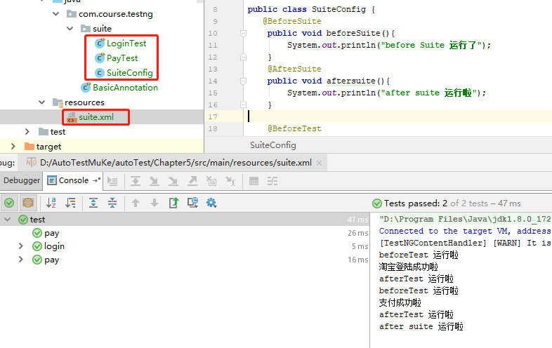

```

```




 一、SuiteConfig 套件配置类

```java
public class SuiteConfig {
   @BeforeSuite
    public void beforeSuite(){
        System.out.println("before Suite 运行了");
    }
    @AfterSuite
    public void aftersuite(){
        System.out.println("after suite 运行啦");
    }
@BeforeTest
public void beftertest(){
    System.out.println("beforeTest 运行啦");
}
@AfterTest
public void afterTset(){
    System.out.println("afterTest 运行啦");
}
    ｝
```
二、登陆类

```java
/*测试套件之前的，共有的方法*/


public class LoginTest {
    @Test
    public void loginTaoBao(){
        System.out.println("淘宝登陆成功啦");
    }
}
```


三、支付类

```java
public class PayTest {
    @Test
    public void paySuccess(){
        System.out.println("支付成功啦");
    }
}
```


四、suite.xml 配置

```javascript
<?xml version="1.0" encoding="UTF-8" ?>
<suite name="test">
    <test name="login">
        <classes>
 <class name="com.course.testng.suite.SuiteConfig"/>
  <class name="com.course.testng.suite.LoginTest"/>
        </classes>
    </test>
    <test name="pay">
        <classes>
 <class name="com.course.testng.suite.SuiteConfig"/>
 <class name="com.course.testng.suite.PayTest"/>
        </classes>
    </test>
</suite>
```

五、运行suite.xml 文件，结果会显示

```
before Suite 运行了
beforeTest 运行啦
淘宝登陆成功啦
afterTest 运行啦
beforeTest 运行啦
支付成功啦
afterTest 运行啦
after suite 运行啦
```

总结：

也就是suite 还是在最外面

beforeTest 和  afterTest 会重复包裹每个方法

