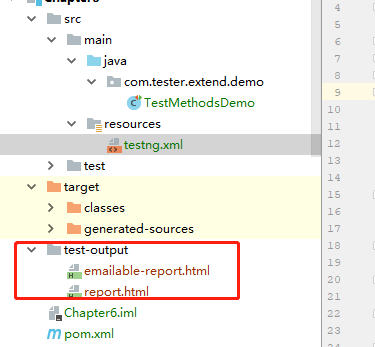
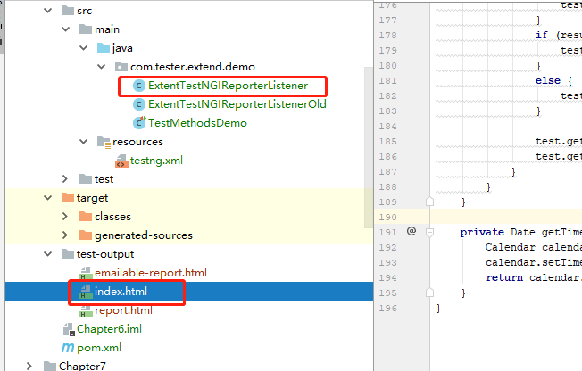
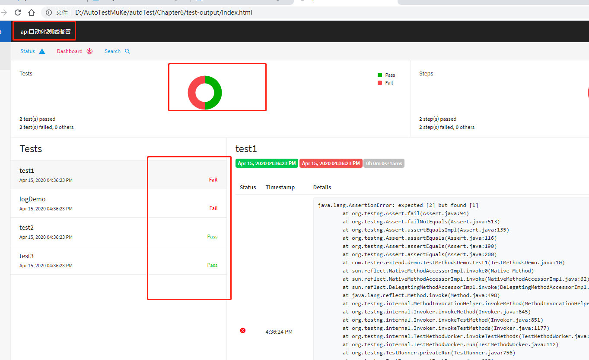

一、在pox文件增加依赖：

主要是前面3个依赖

```javascript
<dependencies>
        <dependency>
            <groupId>com.relevantcodes</groupId>
            <artifactId>extentreports</artifactId>
            <version>2.41.2</version>
        </dependency>
        <dependency>
            <groupId>com.vimalselvam</groupId>
            <artifactId>testng-extentsreport</artifactId>
            <version>1.3.1</version>
        </dependency>
    <dependency>
    <groupId>com.aventstack</groupId>
    <artifactId>extentreports</artifactId>
    <version>3.0.6</version>
   </dependency>
    </dependencies>
```

这里注意，我导入com.aventstack版本4.0.9不行，需要导入3.0.6

二、用例方法例子

TestMethodsDemo 类

```java
public class TestMethodsDemo {
    @Test
    public void test1(){
        Assert.assertEquals("1","2");
    }
@Test
public void test2(){
    Assert.assertEquals("1","1");
}

@Test
public void test3(){
    Assert.assertEquals("aaa","aaa");
}
@Test
public void logDemo(){
    Reporter.log("这个是我们自己写的日志");
    throw new RuntimeException("这个是我们自己抛出的异常");
}
}
```


三、在resources增加配置文件testng.xml

```javascript
<?xml version="1.0" encoding="UTF-8" ?>

<suite name="我自己的接口测试套件">
    <test name="这些是测试模块">
        <classes>
            <class name="com.tester.extend.demo.TestMethodsDemo">
                <methods> <!-- 类下面的方法--> 
                    <include name="test1"/>
                    <include name="test2"/>
                    <include name="test3"/>
                    <include name="logDemo"/>
                </methods>
            </class>
        </classes>
    </test>
    <listeners>
        <listener class-name="com.vimalselvam.testng.listener.ExtentTestNgFormatter"/>
        <!--<listener class-name="com.tester.extend.demo.ExtentTestNGIReporterListenerOld" />-->
        <!--<listener class-name="com.tester.extend.demo.ExtentTestNGIReporterListener" />-->
    </listeners>
</suite>
```


四、运行xml的文件就会产生

test-output的目录，复制路径，在浏览器打开就可以了




五、报告不完善，需要增加一个报告的类，以后都可以用


ExtentTestNGIReporterListener 类

```java

import com.aventstack.extentreports.ExtentReports;
import com.aventstack.extentreports.ExtentTest;
import com.aventstack.extentreports.ResourceCDN;
import com.aventstack.extentreports.Status;
import com.aventstack.extentreports.model.TestAttribute;
import com.aventstack.extentreports.reporter.ExtentHtmlReporter;
import com.aventstack.extentreports.reporter.configuration.ChartLocation;
import com.aventstack.extentreports.reporter.configuration.Theme;
import org.testng.*;
import org.testng.xml.XmlSuite;

import java.io.File;
import java.util.*;

public class ExtentTestNGIReporterListener implements IReporter {
    //生成的路径以及文件名
    private static final String OUTPUT_FOLDER = "test-output/";
    private static final String FILE_NAME = "index.html";

    private ExtentReports extent;

    @Override
    public void generateReport(List<XmlSuite> xmlSuites, List<ISuite> suites, String outputDirectory) {
        init();
        boolean createSuiteNode = false;
        if(suites.size()>1){
            createSuiteNode=true;
        }
        for (ISuite suite : suites) {
            Map<String, ISuiteResult> result = suite.getResults();
            //如果suite里面没有任何用例，直接跳过，不在报告里生成
            if(result.size()==0){
                continue;
            }
            //统计suite下的成功、失败、跳过的总用例数
            int suiteFailSize=0;
            int suitePassSize=0;
            int suiteSkipSize=0;
            ExtentTest suiteTest=null;
            //存在多个suite的情况下，在报告中将同一个一个suite的测试结果归为一类，创建一级节点。
            if(createSuiteNode){
                suiteTest = extent.createTest(suite.getName()).assignCategory(suite.getName());
            }
            boolean createSuiteResultNode = false;
            if(result.size()>1){
                createSuiteResultNode=true;
            }
            for (ISuiteResult r : result.values()) {
                ExtentTest resultNode;
                ITestContext context = r.getTestContext();
                if(createSuiteResultNode){
                    //没有创建suite的情况下，将在SuiteResult的创建为一级节点，否则创建为suite的一个子节点。
                    if( null == suiteTest){
                        resultNode = extent.createTest(r.getTestContext().getName());
                    }else{
                        resultNode = suiteTest.createNode(r.getTestContext().getName());
                    }
                }else{
                    resultNode = suiteTest;
                }
                if(resultNode != null){
                    resultNode.getModel().setName(suite.getName()+" : "+r.getTestContext().getName());
                    if(resultNode.getModel().hasCategory()){
                        resultNode.assignCategory(r.getTestContext().getName());
                    }else{
                        resultNode.assignCategory(suite.getName(),r.getTestContext().getName());
                    }
                    resultNode.getModel().setStartTime(r.getTestContext().getStartDate());
                    resultNode.getModel().setEndTime(r.getTestContext().getEndDate());
                    //统计SuiteResult下的数据
                    int passSize = r.getTestContext().getPassedTests().size();
                    int failSize = r.getTestContext().getFailedTests().size();
                    int skipSize = r.getTestContext().getSkippedTests().size();
                    suitePassSize += passSize;
                    suiteFailSize += failSize;
                    suiteSkipSize += skipSize;
                    if(failSize>0){
                        resultNode.getModel().setStatus(Status.FAIL);
                    }
                    resultNode.getModel().setDescription(String.format("Pass: %s ; Fail: %s ; Skip: %s ;",passSize,failSize,skipSize));
                }
                buildTestNodes(resultNode,context.getFailedTests(), Status.FAIL);
                buildTestNodes(resultNode,context.getSkippedTests(), Status.SKIP);
                buildTestNodes(resultNode,context.getPassedTests(), Status.PASS);
            }
            if(suiteTest!= null){
                suiteTest.getModel().setDescription(String.format("Pass: %s ; Fail: %s ; Skip: %s ;",suitePassSize,suiteFailSize,suiteSkipSize));
                if(suiteFailSize>0){
                    suiteTest.getModel().setStatus(Status.FAIL);
                }
            }

        }
//        for (String s : Reporter.getOutput()) {
//            extent.setTestRunnerOutput(s);
//        }

        extent.flush();
    }

    private void init() {
        //文件夹不存在的话进行创建
        File reportDir= new File(OUTPUT_FOLDER);
        if(!reportDir.exists()&& !reportDir .isDirectory()){
            reportDir.mkdir();
        }
        ExtentHtmlReporter htmlReporter = new ExtentHtmlReporter(OUTPUT_FOLDER + FILE_NAME);
        // 设置静态文件的DNS
        //怎么样解决cdn.rawgit.com访问不了的情况
        htmlReporter.config().setResourceCDN(ResourceCDN.EXTENTREPORTS);

        htmlReporter.config().setDocumentTitle("api自动化测试报告");
        htmlReporter.config().setReportName("api自动化测试报告");
        htmlReporter.config().setChartVisibilityOnOpen(true);
        htmlReporter.config().setTestViewChartLocation(ChartLocation.TOP);
        htmlReporter.config().setTheme(Theme.STANDARD);
        htmlReporter.config().setCSS(".node.level-1  ul{ display:none;} .node.level-1.active ul{display:block;}");
        extent = new ExtentReports();
        extent.attachReporter(htmlReporter);
        extent.setReportUsesManualConfiguration(true);
    }

    private void buildTestNodes(ExtentTest extenttest, IResultMap tests, Status status) {
        //存在父节点时，获取父节点的标签
        String[] categories=new String[0];
        if(extenttest != null ){
            List<TestAttribute> categoryList = extenttest.getModel().getCategoryContext().getAll();
            categories = new String[categoryList.size()];
            for(int index=0;index<categoryList.size();index++){
                categories[index] = categoryList.get(index).getName();
            }
        }

        ExtentTest test;

        if (tests.size() > 0) {
            //调整用例排序，按时间排序
            Set<ITestResult> treeSet = new TreeSet<ITestResult>(new Comparator<ITestResult>() {
                @Override
                public int compare(ITestResult o1, ITestResult o2) {
                    return o1.getStartMillis()<o2.getStartMillis()?-1:1;
                }
            });
            treeSet.addAll(tests.getAllResults());
            for (ITestResult result : treeSet) {
                Object[] parameters = result.getParameters();
                String name="";
                //如果有参数，则使用参数的toString组合代替报告中的name
                for(Object param:parameters){
                    name+=param.toString();
                }
                if(name.length()>0){
                    if(name.length()>50){
                        name= name.substring(0,49)+"...";
                    }
                }else{
                    name = result.getMethod().getMethodName();
                }
                if(extenttest==null){
                    test = extent.createTest(name);
                }else{
                    //作为子节点进行创建时，设置同父节点的标签一致，便于报告检索。
                    test = extenttest.createNode(name).assignCategory(categories);
                }
                //test.getModel().setDescription(description.toString());
                //test = extent.createTest(result.getMethod().getMethodName());
                for (String group : result.getMethod().getGroups())
                    test.assignCategory(group);

                List<String> outputList = Reporter.getOutput(result);
                for(String output:outputList){
                    //将用例的log输出报告中
                    test.debug(output);
                }
                if (result.getThrowable() != null) {
                    test.log(status, result.getThrowable());
                }
                else {
                    test.log(status, "Test " + status.toString().toLowerCase() + "ed");
                }

                test.getModel().setStartTime(getTime(result.getStartMillis()));
                test.getModel().setEndTime(getTime(result.getEndMillis()));
            }
        }
    }

    private Date getTime(long millis) {
        Calendar calendar = Calendar.getInstance();
        calendar.setTimeInMillis(millis);
        return calendar.getTime();
    }
}
```





