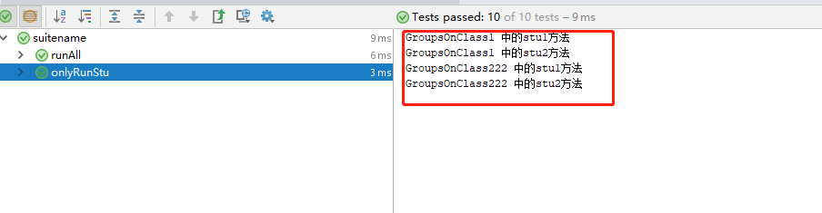

方法分组

```java
public class GroupsOnMethod {
@Test(groups = "server")
public void test1(){
    System.out.println("这是服务端组的测试方法11111");
}

@Test(groups = "server")
public void test2(){
    System.out.println("这是服务端组的测试方法2222");
}

@Test(groups = "client")
public void test3(){
    System.out.println("这是客户端组的测试方法33333");
}
@Test(groups = "client")
public void test4(){
    System.out.println("这是客户端组的测试方法4444");
}

@BeforeGroups("server")
public void beforeGroupsOnServer(){
    System.out.println("这是服务端组运行之前运行的方法");
}

@AfterGroups("server")
public void afterGroupsOnServer(){
    System.out.println("这是服务端组运行之后运行的方法！！！！！");
}

@BeforeGroups("client")
public void beforeGroupsOnClient(){
    System.out.println("这是客户端组运行之前运行的方法");
}

@AfterGroups("client")
public void afterGroupsOnClient(){
    System.out.println("这是客户端组运行之后运行的方法！！！！！");
}
｝
```

总结：方法组测试

@BeforeGroups("server")

@AfterGroups("server")

这个server 就是上面方法（(groups = "server") ，这样就可以达到分类了


类分组测试，配置


类1

```java
//把@Test写在类上面
@Test(groups = "stu")
public class GroupsOnClass1 {
    public void stu1() {
        System.out.println("GroupsOnClass1 中的stu1方法");
    }
    public void stu2() {
        System.out.println("GroupsOnClass1 中的stu2方法");
    }

}
```

类2

```java
@Test(groups = "stu")
public class GroupsOnClass2 {
    public void stu1() {
        System.out.println("GroupsOnClass222 中的stu1方法");
    }
    public void stu2() {
        System.out.println("GroupsOnClass222 中的stu2方法");
    }
}
```

类3

```java
@Test(groups = "teacher")
public class GroupsOnClass3 {
    public void teacher1() {
        System.out.println("GroupsOnClass3 中的teacher1方法");
    }
    public void teacher2() {
        System.out.println("GroupsOnClass3 teacher2");
    }
```


.xim配置

```javascript
<?xml version="1.0" encoding="UTF-8" ?>
<suite name="suitename">
    <test name="runAll">  <!--这个是运行所有的-->
  
        <classes>
            <class name="com.course.testng.groups.GroupsOnClass1"/>
            <class name="com.course.testng.groups.GroupsOnClass2"/>
            <class name="com.course.testng.groups.GroupsOnClass3"/>
        </classes>
    </test>
    <test name="onlyRunStu"> <!--这个是运行部分的类的分组的-->
        <groups>
            <run>
                <include name="stu"/>
            </run>
        </groups>

        <classes>
            <class name="com.course.testng.groups.GroupsOnClass1"/>
            <class name="com.course.testng.groups.GroupsOnClass2"/>
            <class name="com.course.testng.groups.GroupsOnClass3"/>
        </classes>

    </test>
</suite>
```



总结：结果只有属于stu这个分组的类才会运行

   <groups>
            <run>
                <include name="stu"/>
            </run>
        </groups>


