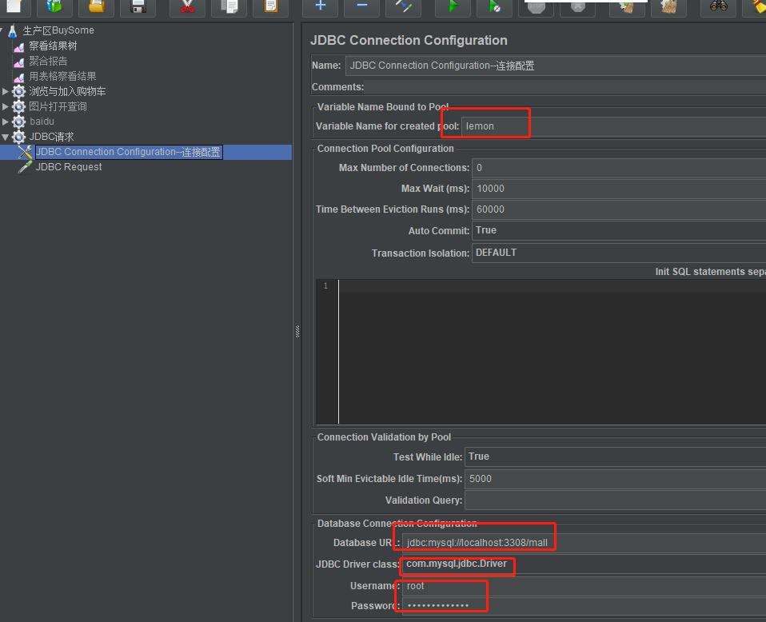

性能测试，密码是加密的。怎么拿数据测试数据？

---

1、直接调用注册接口完成数据的制定；

2、可不可以直接操作数据库？关联标太多了，就不推荐

1、加密方法---beanshell

2、调用类方法---生产加密的字符串----vars.put(存进变量，变量来源) 存到jmeter里面作为jmeter的变量

3、调用变量${};

怎么生产1000条数据?设置循环就可以了。在线程组加次数就可以了

