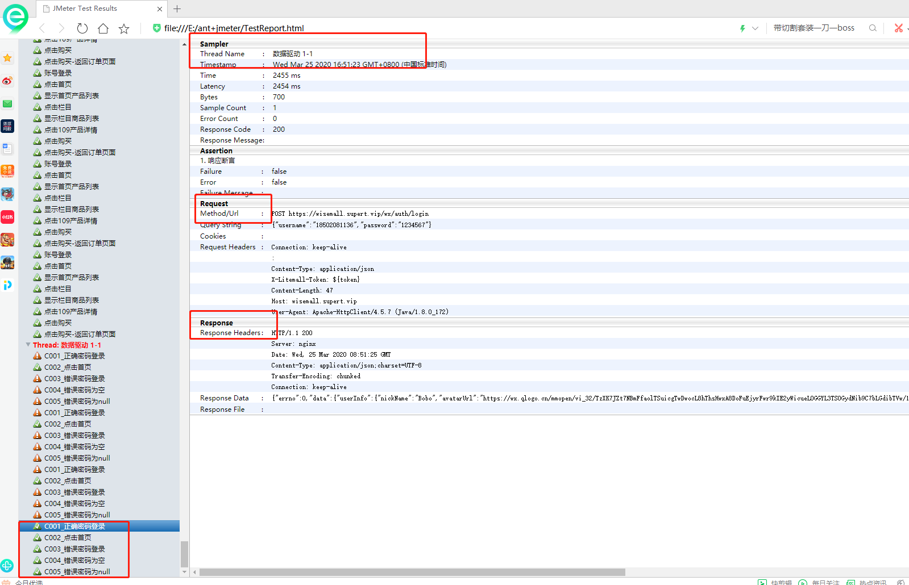

###### 一、接口自动化

1、增加配置元件---请求默认值

2、如果有参数关联要求token，配置元件---请求头  ，token参数化

然后再加一个

3、逻辑控制器—循环控制器

3.1再循环控制器下，增加配置元件-CSVdata 

这里的文件名就是对于CSV的路径

参数按照再CSV的顺序填写

3.2再循环控制器增加 如果（If）控制器_优先级

${__jexl3("${Prority}"=="H")}

3.2.1 如果（If）控制器_优先级 下增加  两个“如果（if）控制器”  get和post请求

${__jexl3("${protocal}"=="GET")}

${__jexl3("${protocal}"=="POST")}

增加post请求，都是参数化

如果有接口需要关联，正则表达式

响应信息

执行后，都通过

###### 二、注意

也可以通过ant+jmeter构建自动化报告

1、随便建一个文件，然后把build.xml  和脚本放在文件里面

2、打开dos命令

输入：ant

3、输出结果

4、查看结果

三、另外一种结果，再研究

