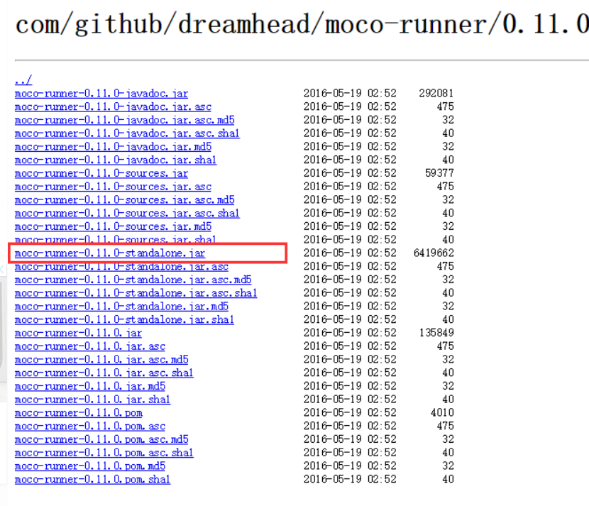
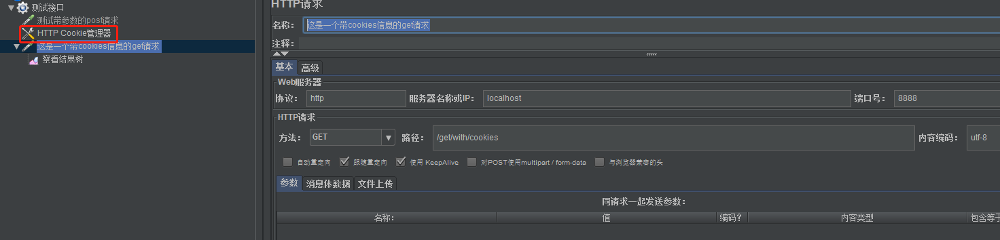
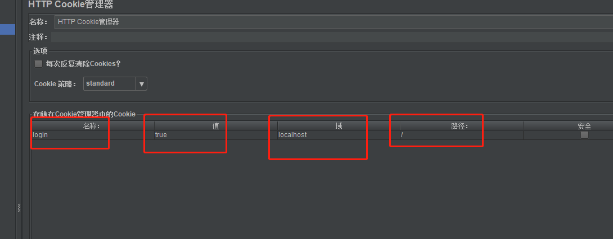

用moco工具mock接口

1.下载moco  jar包，下载地址：https://repo1.maven.org/maven2/com/github/dreamhead/moco-runner/0.11.0/



2.创建Json文件mock接口

3.运行命令

java -jar ./moco-runner-0.11.0-standalone.jar 协议 -p 端口号 -c 文件名.json
协议：一般是http，如果用到其他的协议填写对应的即可

端口号：随便写，比如8888

文件名.json：创建的json文件名

4.用浏览器或jmeter等相关工具验证是否正确
输入localhost：端口/路径   或者 127.0.0.1:8888/demo

5.带参数的get请求与post请求的不同之处：get用queries  post用forms

[

{
    "description": "模拟一个有参数的get请求",
    "request": {
        "uri": "/getwithparam",
        "method": "get",
        "queries": {
            "name": "huhansan",
            "age": "18"
        }
    },
    "response": {
        "text": "这是一个有参数的get request"
    }
}，


{
    "description": "模拟一个有参数的get请求",
    "request": {
      "uri": "/postwithparam",
      "method": "post",
      "forms": {
        "name": "huhansan",
        "sex": "man"
      }
    },
    "response": {
      "text": "这是一个有参数的post request"
    }
  }
]


这是一个带cookies信息的get请求

```java
[  {    "description":"这是一个带cookies信息的get请求",    "request":{      "uri":"/get/with/cookies",      "method":"get",      
 "cookies":{
 "login":"true"      
 }
 },
  "response":{     
  "text":"这个是需要携带cookies信息才能防伪的get请求"    }  
   }
]
```



需要在配置元件增加-HTTP Cookies管理器

注意这个四个框的填写

