一、下载安装包

```java
Python官网地址：https://www.python.org/downloads/
```


二、安装

（自定义路径）

（1）选择定制安装

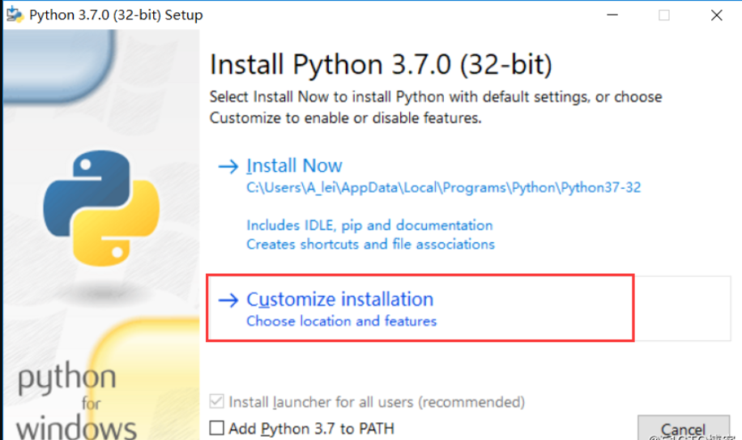
（2）选择next，继续
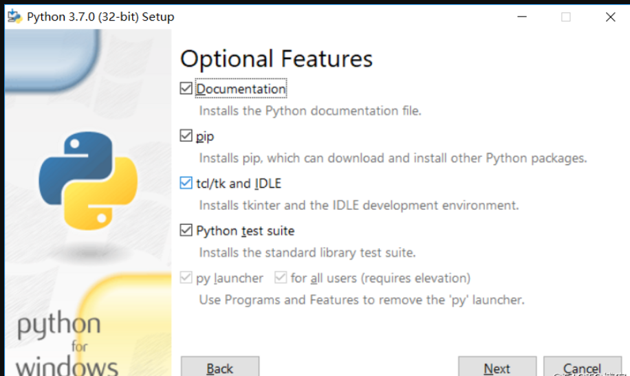
（3）更改安装路径：C:\python37；选择install，进行安装
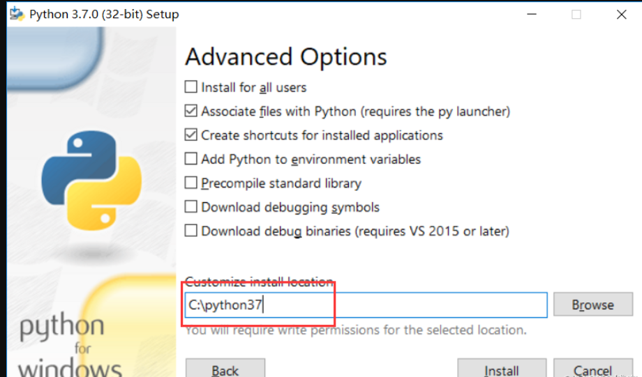
（4）安装完成
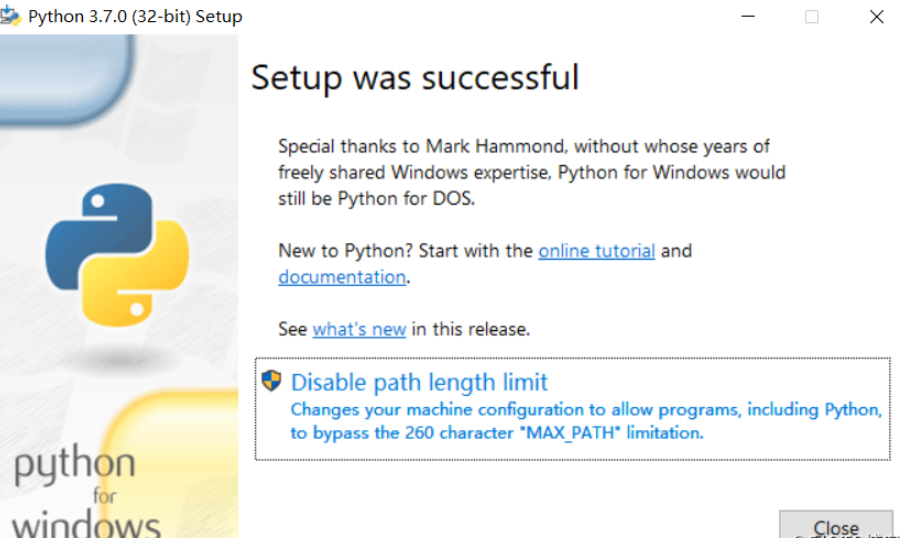

## 3、配置环境变量

（1） 【右键计算机】--》【属性】

（2）【高级系统设置】

（3）【高级】--》【环境变量】

【系统环境变量处】：
在源有的PATH变量进行更改即**编辑**；

（4）选择“PATH变量”选择【编辑】；

在变量值最后一行添加“C:\python37”；点击【确定】；
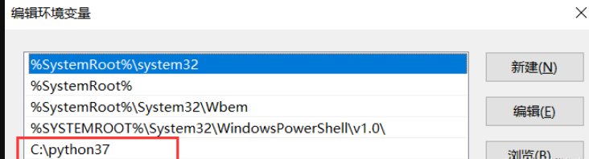


## 4、测试

（1）windows键加r，在出现的窗口输入cmd并确定

（2）在dos窗口输入python，可以进入python运行环境，大功告成！！

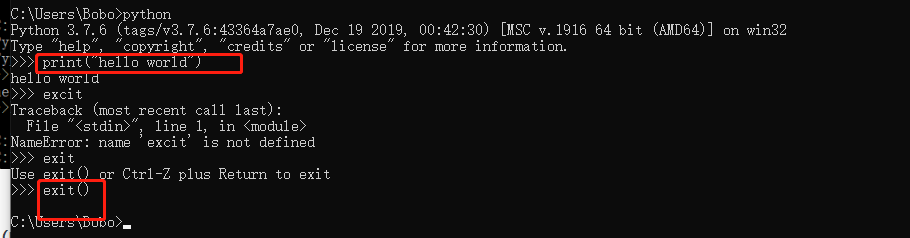


5、安装pycharm

##### 第一步：正常的安装Pycharm，一直下一步到finish

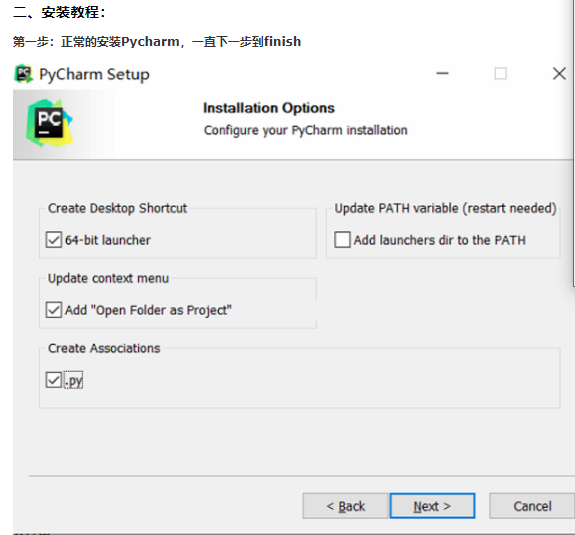

##### 第二步：将刚才的破解文件放入安装的目录的bin目录下

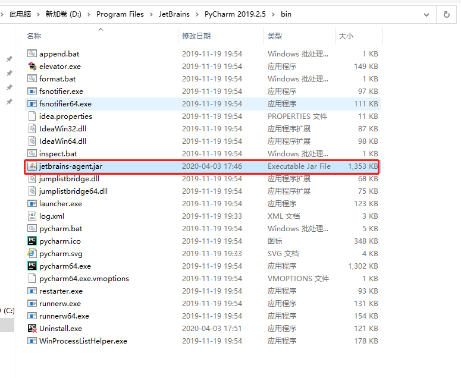


##### 第三步：打开Pycharm，并选择免费试用

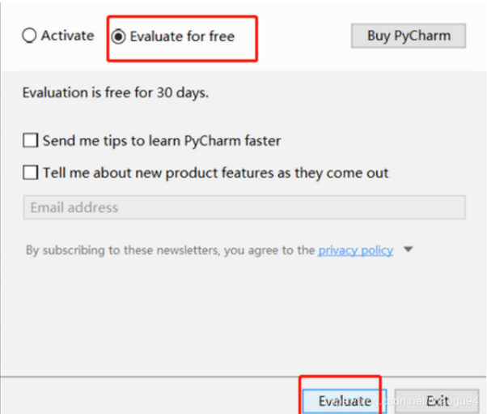

##### 第四步：点击最上方的Help->Edit Custom VM Options

如果提示要创建文件，点击“yes”，没有的话忽略，这时候会打开一个文件。

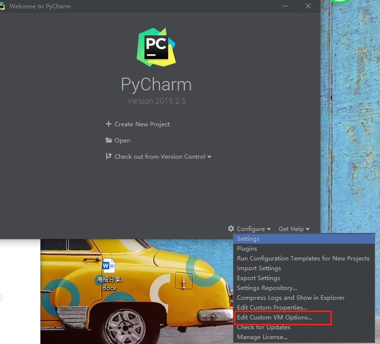

##### 第五步：在文件的最下面添加上一句话

-javaagent:自己pycharm的安装目录\jetbrains-agent.jar

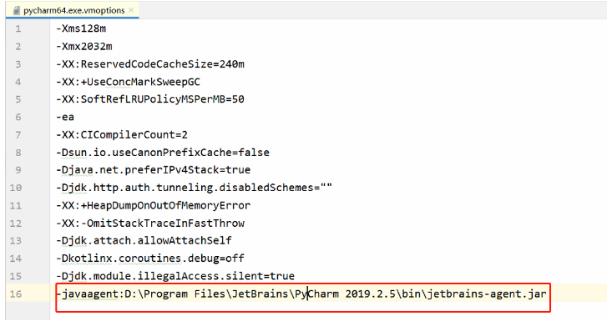

##### 第六步：先重启Pycharm（必须），然后点击Help->Register...

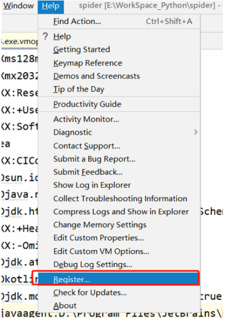


##### 第七步：选择最后一个License server

输入：[http://fls.jetbrains-agent.com](http://fls.jetbrains-agent.com/)
或者：[http://jetbrains-license-server](http://jetbrains-license-server/)
然后点击Activate

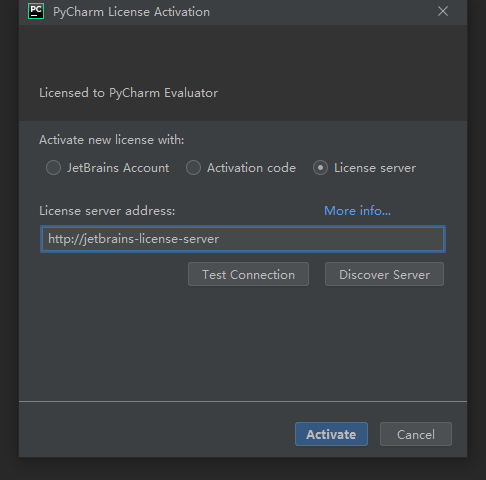


##### 第八步：over，实现了永久破解

安装包及破解文件下载链接：https://pan.baidu.com/s/1AmF6y62LQZ9yuxF5FNqgyA
提取码：bdy7。 如果失效的话可以关注公众号【编程开发分享者】并回复：Pycharm破解。