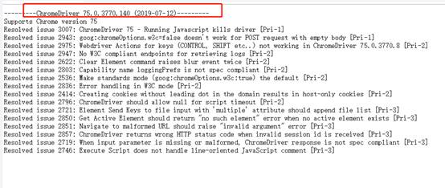

Selenium

1、下载Selenium jar包：

selenium-server-standalone-3.141.59.jar

2、下载驱动：

检查Chrome 版本是否与符合：

https://npm.taobao.org/ 通过这个链接：

找到对应的版本驱动：

3、导入selenium jar包

一.打开IntelliJ IDEA，导入selenium.jar包。点击菜单栏 File –> Project Structure（快捷键Ctrl + Alt + Shift + s） ，点击 Project Structure界面左侧 的“Modules” 。在“Dependencies” 标签界面下，点击右边绿色的“+” 号，选择第一个选项“JARs or directories…” ，选择相应的 jar 包，点“OK” ，jar包添加成功。

\--------------------- 

启动 IDEA

如果是第一次打开IDEA 直接点击 【Create New Project】,如果之前打开过，那么点击菜单【File】-->【New】-->【Project...】如下图：

注意：如果【Project SDK】中为空，先确认是否已经安装JDK，如果已经安装，点击【New...】选取jdk的安装路径，出现这个原因大多因为先安装IDEA，后安装JDK引起。

3.在左边选项，选择【Maven】,然后点击【Next】，填写【GroupID】【ArtifactID】和【Version】，如下图：

4.点击【Next】,填写项目名【Project name】和项目存放路径【Project location】,如下图项目名为first_maven_project，存放在 E:\Selenium Demo 路径下： 
 5.点击【Finish】，如果步骤4存放的路径不存在会提醒是否新建。这样我们的第一个Maven 项目便已经新建完成，如下图所示：

 

maven工程已经新建完成，下去我们需要导入Selenium 2.0相应的jar包。
 1.打开：http://mvnrepository.com/artifact/org.seleniumhq.selenium/selenium-java ，selenium的仓库地址
 2.选择最新版selenium，例如当前最新版本的是2.53.0，则进入如下图：

 

3.复制Maven 标签内的内容，添加到刚新建的maven项目中的pom.xml文件中，如下：注意:复制进来的内容，需要包含在<dependencies></dependencies>标签中。

4.点击一直停留在IDEA右上方的【Enable Auto-Import】，自动导入包。

5.等待自动化导入，导入成功后会在IDEA右边的【Maven Projects】中显示通过maven导入的jar包：

正确的导入包：

建立project后src下建立一个lib的目录

2.收集的jar包全部复制粘贴过去

3.选中所有jar包右键点击如图按钮，将jar包添加到工程库中，可能会有一段时间加载jar包的过程

5.搞定后在Java目录下新建一个package

6.新建一个demo.java文件开始写selenium脚本

搭建selenium+chrome+maven 

1.刚刚上面安装的步骤还是要看的

特别要注意的是下载

1、下载Selenium jar包：

selenium-server-standalone-3.8.0.jar

直接复制黏贴也就，相当于导入jar包了。

2.另外要下载ChromeDriver与Chrome版本对应及下载地址

 ChromeDriver与Chrome版本对应及下载地址：ChromeDriver官方网站或ChromeDriver仓库 

2.1然后下载对应的版本：

下载后，把对应的 驱动放到浏览器的目录下

将chromeDriver放到chrome下安装目录下，并将chromeDriver目录加入到path中

例如：我的driver路径，将C:\\Users\\Bobo\\AppData\\Local\\Google\\Chrome\\Application加入到path中。

 启动脚本

public class ChromTest01 {
   public static void main(String[] args) {
     System.setProperty("webdriver.chrome.driver","C:\\Users\\Bobo\\AppData\\Local\\Google\\Chrome\\Application\\chromedriver.exe");
 //实例化一个Chrome浏览器的实例
     WebDriver driver = new ChromeDriver();
 //设置打开的浏览器窗口最大化
 //    driver.manage().window().maxmize();
 //设置隐性的等待时间
     driver.manage().timeouts().pageLoadTimeout(5, TimeUnit.SECONDS);
 //使用get()打开一个网站
     driver.get("https://www.baidu.com");
 //getTitle()获取当前页面的title，用System.out.println()打印在控制台
     System.out.println("当前打开页面的标题是： "+ driver.getTitle());
 //关闭浏览器
     driver.quit();
   }