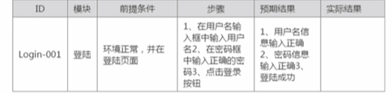
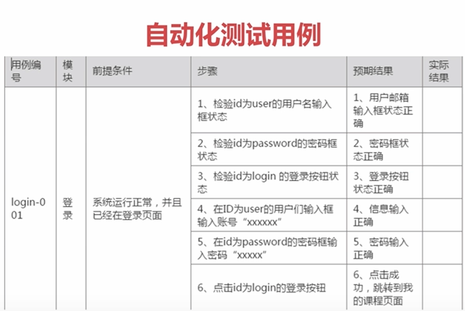

###   第1章 课程整体介绍【有问题请在问答区进行问答，老师会为您答疑，祝您学有所获】

####   1-1 课前必看【开启新的学习，不要错过前置知识】 ####    

####   1-2 高效的学习方法【只有掌握学习方法，方能学会知识，不要错过一个亿】

####   1-3 【知道自动化测试为何能升职加薪】功能测试和自动化测试区别

####   1-4 【常见V型流程】自动化测试流程

######    选择方案-制定测试计划-环境搭建-用例准备-编码-分析结果-

####   1-5 【自动化测试的技法】自动化测试用例的编写

###### 1.5.1手工用例与自动化用例区别

手工用例：

ID、模块、前提条件、步骤、预期结果、实际结果



自动化用例：



1、步骤不一样；

2、精度不一样，id检验

###### 1.5.2如何编写自动化用例

| ID     | 模块 | 测试点   | 前提条件     | 步骤                                                         | 预期结果                                                     |
| ------ | ---- | -------- | ------------ | ------------------------------------------------------------ | ------------------------------------------------------------ |
| Log-01 | 登陆 | 冒泡测试 | 系统运行正常 | 1、首页点击登陆按钮，获取id为="js-signin-btn"     2、在登陆框中，检查name为email的输入框的状态                                 3、在登陆框中，检查name为password的输入框的状态     4、在登录框中检查classname为moco-btn的按钮状态     5、登陆框中，在name为“email”的输入框中输入正确的用户信息     6、在登陆框中，检查name为password的输入框中输入正确的用户密码     7、在登陆框中，点击classname为moco-btn的按钮     8、检查用户信息登陆是否成功，获取id="header-avator"的状态     9、在个人中心页面获取classname为“user-name的属性信息 | 1、弹出登陆框     2、name为“email”的输入正确         3、name为password的输入状态         4、class为moco-btn的按钮状态正确     5、在name为“email”的输入框中输入信息正确          6、name为password的输入框中输入信息正确     7、点击按钮成功，登陆成功     8、获取状态成功，用户信息正确；     9、用户信息和我们登陆的信息一致 |
|        |      |          |              |                                                              |                                                              |

###   第2章 Selenium基础知识【建议回看《自动化测试之selenium工具使用 》】 

####   2-1 【工欲善其事必先利其器】环境配置

可以百度学习


####   2-2 【熟悉页面方能做好测试】HTML页面基础定位知识

通常定位是在body里面的

<a>/<ul><li><div><input><i>标签定位

通常id、class、

####   2-3 【用对工具提高测试效率】HTML页面元素定位工具讲解

10大定位

还有表格定位和层级定位


####   2-4 【定位唯一元素的秘籍】HTML页面中如何确认元素的唯一性

####   2-5 【送您十大定位方法】元素定位

####   2-6 【工作常见方法】常见元素处理-理论

####   2-7 Input输入元素操作

文本框： sendkeys、clear、getAttribute（获取属性值）

单选框：click、clear、isSelected

多选框：click、clear、isSelected、isEnabled

按钮：click、isEnabled

表单：

上传文件：


```java
/*输入框 input*  以慕课网的登陆为例子*/
    public void inputBox(){
        driver.findElement(By.name("email")).sendKeys("463101149@qq.com");
        //停顿2秒
        try {
            Thread.sleep(2000);
        } catch (InterruptedException e) {
            e.printStackTrace();
        }
        driver.findElement(By.name("email")).clear();//清除刚刚输入的，点击后就是出现    请输入登录手机号/邮箱
       String s= driver.findElement(By.name("email")).getAttribute("placeholder");//getAttribute 获取对应属性的值
        System.out.println(s);
        driver.findElement(By.name("email")).sendKeys("463101149@qq.com");
        driver.findElement(By.name("password")).sendKeys("tang.123");
        driver.findElement(By.className("moco-btn")).click();
        try {
            Thread.sleep(4000);
        } catch (InterruptedException e) {
            e.printStackTrace();
        }
    }
        
```


​    


####   2-8 Radio元素操作

```java
    /*单选框，是以慕课网，编辑个人信息作为例子的
    * */
    public void radioBox(){
        driver.get("https://www.imooc.com/user/setprofile");
        driver.findElement(By.className("pull-right")).click();
      //  driver.findElement(By.name("sex")).click();  因为是单选框，不能点击的，会报错
       // driver.findElement(By.xpath(""))
       //因为定位的结果有3个，所有用结集合List
        List<WebElement> elements=driver.findElements(By.xpath(".//*[@id='profile']/div[4]/div/label//input"));//有三个label标签选项,所有的input  用// 代表所有input ；要一起定位3个label ，用findElements
        System.out.println(elements.size());
      //结果需要循环，WebElement 类型，变量：上面定义的变量elements
        try {
            Thread.sleep(4000);
        } catch (InterruptedException e) {
            e.printStackTrace();
        }
        for (WebElement radio:elements){
          //单选框是布尔类型
           Boolean flag= radio.isSelected();
           if (flag==false){//如果没有选中
               radio.click();//下面就是选中
               break;
           }else {
               System.out.println("选择了");
           }
```


####   2-9 CheckBox元素操作


```java
/*多选框*/
    //isSelected()，很显然，这个是判断某个元素是否被选中。
    //isEnable用于存储input、select等元素的可编辑状态，可以编辑返回true，否则返回false
    public void checkBox(){
        //清除登录页面的自动登录选择√
       // driver.findElement(By.id("auto-signin")).clear();
       WebElement check= driver.findElement(By.id("auto-signin"));
        System.out.println("是否选中了呢  "+check.isSelected());
        System.out.println("是否有效   "+check.isEnabled());
    //    check.clear();
        try {
            Thread.sleep(2000);
        } catch (InterruptedException e) {
            e.printStackTrace();
        }
        check.click();}
```

####   2-10 Button元素操作

```java

    /*按钮 ，以登录按钮为例子  buttom*/
    public void  buttom(){
       WebElement login= driver.findElement(By.className("moco-btn"));
        System.out.println(login.isEnabled());
        System.out.println(login.getAttribute("value"));
        login.click();

    }
 /*表单   <form> 标签 以登录为案例   */
    public void webForm(){
        driver.get("...");
        driver.findElement(By.id("signup-form")).submit();
    }
```

###   第3章 Selenium基础知识实战讲解

####   3-1 上传文件处理 ####    

* ```java
   /*上传文件
   *直接跳转到个人中心页面，然后上传头像
   
   * */
     public void upHeader(){
         driver.get("http://www.imooc.com/user/setbindsns");
         try {
             Thread.sleep(2000);
         } catch (InterruptedException e) {
             e.printStackTrace();
         }
         //这串js，先再控制台console，调试document.getElementsByClassName('js-avator-link')[0].style.bottom='0';
         //因为上传头像这个按钮是隐藏的，因此需要她暂时显示出来。方便点击。需要执行js
         String jsString="document.getElementsByClassName('update-avator')[0].style.bottom='0';";
         //转换成为js
         JavascriptExecutor js= (JavascriptExecutor) driver;
         js.executeScript(jsString);
         try {
             Thread.sleep(2000);
         } catch (InterruptedException e) {
             e.printStackTrace();
         }
         driver.findElement(By.className("update-avator")).click();
         //点击上传，就是上传图片，就是本地图标路径
         driver.findElement(By.id("upload")).sendKeys("E:\\星厨掂餐\\图片\\环境.jpg");
     }
   ```
   
   

####   3-2 autoit上传文件


####   3-3 webform表单提交

####   3-4 上传文件方法

####   3-5 下拉框选择

```java
/*
* 下拉框操作  :以个人信息为例子
*1、下拉框定位
* Select list=new Select(locator);
* 选择对应的元素：selectByVisibleText、selectByValue、selectByIndex
* 不选择对应的元素：deselectAll、deselectByValue、deselectByVisibleText  多选才可用
* 获取选择项的值：getAllSelectedOptions、个体FirstSelectOption().getText
* */

    public void downsSelectBox()  {
        driver.get("http://www.imooc.com/user/setprofile");
        driver.findElement(By.className("pull-right")).click();
        try {
            Thread.sleep(1000);
        } catch (InterruptedException e) {
            e.printStackTrace();
        }
        //先把父节点的表单找到先
        WebElement formElement=driver.findElement(By.id("profile")) ;
        WebElement job= formElement.findElement(By.id("job"));//存储下来先
        //接下来要声明一个select对象
      Select downList=new Select(job);
   //   downList.selectByIndex(2);//因为有个多个选择，那么就有3种方式定位，现在这个是下标定位、数值、文本
   //     downList.selectByValue("1");
   //     downList.selectByVisibleText("学生");


  //不选择对应元素怎么操作呢？
        downList.selectByIndex(3);
        downList.deselectByIndex(3);//deselectByIndex是取消多选的下拉
        System.out.println(downList.isMultiple());//isMultiple这个函数可以查询是否多选的，输出true和false
      //  downList.deselectByVisibleText("学生");

        //获取选择项的值
      //  System.out.println(downList.getAllSelectedOptions());//或者所有选项中，获取结果需要循环
        List<WebElement> List=downList.getAllSelectedOptions();//集合存起来，看结果用循环
        for (WebElement options:List){
            System.out.println(options.getText());//还是打印当前的、说明还是多选的才用到这个getAllSelectedOptions

        }
        System.out.println(downList.getFirstSelectedOption().getText());//获取当前下来列表已经有的选项 的第一个文本

    }
```

####   3-6 selenium下拉框自带方法使用讲解

####   3-7 selenium下拉框方法详解

####   3-8 selenium鼠标事件讲解


```java
 /*
    鼠标操作
    鼠标左击：  Actions action= newActions(driver); Action.click().perform();
    鼠标右击: Actions action= newActions(driver); Action.contextClick().perform();
     鼠标双击: Actions action= newActions(driver); Action.double.Click().perform();
     鼠标悬停: Actions action= newActions(driver); Action.moveToElement.perform();
    慕课网的登录*/

    public void moseAction(){
        WebElement login=driver.findElement(By.id("js-signin-btn"));
        Actions action= new Actions(driver);
     //   action.click(login).perform();  点击
        action.contextClick(login).perform();//右击
        action.doubleClick(login).perform();//双击
    }

   /* 悬停，以首页的标题为例子*/
   public void moseAction2(){
       driver.get("https://www.imooc.com/");
       WebElement login=driver.findElement(By.className("menuContent")); //先定位父节点
       List<WebElement> item=login.findElements(By.className("item"));//用list集合，把所有结果都定位出来，再通过下标数来定位具体的位置；
       Actions action= new Actions(driver);
       action.moveToElement(item.get(1)).perform();//通过下标定位具体的位置
       driver.findElement(By.linkText("HTML/CSS")).click();

   }
```
####   3-9 Iframe切换处理及处理无焦点问题

```java
   /*
       * iframe处理
       * switchTo()
       * getWindowHandles()
       * */
       public void iframe(){
           driver.get("http://www.imooc.com/wiki/create");
           WebElement iframeElement=driver.findElement(By.id("ueditor_0"));//获取这个页面的ID
           driver.switchTo().frame(iframeElement);//然后切换到fram框架，然后再才做
           driver.findElement(By.tagName("body")).sendKeys("this is test");//tagName 是指标签名的定位
       }


       /*多个窗口的切换操作
       * 以HTML/CSS  的 点击 案例为例子
       *
       * */
    public void windowsHandle(){
    
        Set<String> handles=driver.getWindowHandles();//获取所有的窗口，多个结果，string类型，set集合
       //for循环所有的窗口，

   /* 第一种
      for (String s:handles){
            driver.switchTo().window(s); //这个就是跳转到最新的窗口
        }
        driver.findElement(By.linkText("案例")).click();
    }
*/  //
        // 第二种，循环所有的窗口，然后再拿当前的窗口对比上一个窗口（在鼠标悬停哪里已经获取到 （ windowsHandle=driver.getWindowHandle();），如果相等，就继续往下循环，如果不相等，那就是最新的了，就跳转到那个窗口；
        for (String s:handles){
            if (s.equals(windowsHandle)){//需要在当前类定义windowsHandle变量；
                continue;
            }
            System.out.println(s);
            driver.switchTo().window(s); //这个就是跳转到最新的窗口
        }
        driver.findElement(By.linkText("案例")).click();
    }
```


####   3-10 多窗口的切换

####   3-11 弹窗的处理

####   3-12 强制、隐式、显示等待

####   3-13 selenium基础面试技巧

###### 3.13.1自动化你遇到什么问题？元素定位不到

###### 3.13.2如何解决问题：网速问题、电脑问题、添加等待时间、重试机制；

###### 3.13.3selenium是怎么工作的？

###### 3.13.4常见的定位方式，常用的哪一种（css和xpath，但是xpath效率比较低，那回答那种方式简单就好用那种）：8大定位、id、classname、tagname、linkText、层级定位、xpath、表单定位、css定位

###### 3.13.5 上传图片有几种方式：

input类型的可以用sendkeys，

非input类型的可用用 auto it

###### 3.13.6如何处理动态元素

用xpath定位


###   第4章 自动化测试框架基础实战【重点章节，请多多实战】

####   4-1 登陆功能需求分析及用例设计

####   4-2 对登陆功能进行功能测试

####   4-3 登陆自动化用例设计

####   4-4 自动化环境maven的搭建

####   4-5 maven项目的创建

####   4-6 开放自动化登陆脚本

####   4-7 对登陆脚本进行重构

####   4-8 登陆脚本element封装

####   4-9 如何读取配置文件

####   4-10 重构读取配置文件方法

###   第5章 自动化测试框架进阶实战【重点章节，建议多听多操作】

####   5-1 设计定位方式方法封装

####   5-2 实战登陆账号参数化

####   5-3 Testng的环境搭建及简单使用

可以在Maven导入依赖

```java
    <dependencies>
        <dependency>
            <groupId>org.seleniumhq.selenium</groupId>
            <artifactId>selenium-java</artifactId>
            <version>3.14.0</version>
        </dependency>

        <dependency>
            <groupId>org.testng</groupId>
            <artifactId>testng</artifactId>
            <version>7.0.0</version>
        </dependency>

        <dependency>
            <groupId>log4j</groupId>
            <artifactId>log4j</artifactId>
            <version>1.2.17</version>
        </dependency>
    </dependencies>
```

####   5-4 TestNG实战使用方法讲解

####   5-5 case运行错误截图

getScreenshotAs()

####   5-6 登陆失败会自动截图####   ####    

####   5-7 testNG监听原理及代码实现

####   5-8 testNG实现失败自动截图

####   5-9 log4j的环境配置及初级使用

####   5-10 log4j输出详细信息使用

####   5-11 发送邮件处理

###   第6章 自动化测试之代码实战训练【重点章节，多练多收获】

####   6-1 课程列表实战需求分析

####   6-2 如何遍历课程定位分析

####   6-3 遍历课程实战代码错误分析

####   6-4 通过xpath遍历课程实战及错误分析

####   6-5 遍历课程实战-xpath的正确实现

####   6-6 遍历课程解决元素遮挡问题

####   6-7 如何通过list去循环课程

####   6-8 如何设计遍历底部页码实战

####   6-9 设计遍历底部页码实战

####   6-10 循环课程体系代码完善

###   第7章 PageObject的实现到企业实战【封装的秘籍】

####   7-1 什么是PageObject

####   7-2 如何在实战项目中进行分层设计

####   7-3 登陆代码分层设计之page和BasePage实现

####   7-4 登陆代码分层设计之LoginHandle层实战

####   7-5 登陆代码分层涉及之LoginCase层实战

####   7-6 登陆代码分层涉及之如何判断case通过及项目中如何使用截图

####   7-7 分层项目实战之项目代码中如何保存日志信息

####   7-8 分层设计之如何实现企业化的代码编写

####   7-9 分层设计之企业实战中数据的管理及传递

####   7-10 分层设计之企业实战中BaseCase的设计及不同case驱动不同浏览器

####   7-11 分层设计只企业实战中如何输出一份美观的报告

####   7-12 selenium框架技巧

###   第8章购物流程从简单到企业实战【掌握企业在复杂流程中的测试】 

####   8-1 购买商品功能需求分析

####   8-2 购物流程功能分析及用例设计

####   8-3 购物流程自动化用例设计

####   8-4 购买商品代码实战及错误分析

####   8-5 购买商品代码实战及错误分析2

####   8-6 购物流程之登陆状态监测

####   8-7 购物流程之未登陆处理及错误排查

####   8-8 购物流程之page页面封装

####   8-9 购物流程之handle层的封装

####   8-10 购物流程之课程页面case设计实战

####   8-11 购物流程设计之case企业化设计实战

####   8-12 购物流程设计之企业化case实战

###   第9章 TestNG在企业中运用【重点】 

####   9-1 TestNG配置介绍

####   9-2 TestNG如何运行case

####   9-3 TestNG跳过某个case

####   9-4 TestNG参数化管理

####   9-5 TestNG多线程执行打开多浏览器

####   9-6 TestNG中Groups的运用

####   9-7 TestNG中依赖的运用

####   9-8 TestNG中case超时设置及查找元素方法重构

###   第10章 订单流程企业实战封装【建议多实战】 

####   10-1 下单页需求分析及功能测试

####   10-2 下单页自动化化用例设计

####   10-3 下单页面page层设计

####   10-4 下单页面handle层设计

####   10-5 下单页面case层设计

####   10-6 重构Handle层设计

####   10-7 邮件如何发送测试报告

####   10-8 TestNG监听实现执行case后自动发送邮件

###   第11章 持续集成【可以让你随时随地都可以对线上系统进行自动化测试】

####   11-1 持续集成的环境配置

####   11-2 持续集成之项目配置及Jenkins中文乱码问题

####   11-3 持续集成之发送邮件通知

####    11-4 面试实战技巧

  