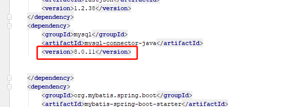

接口报错信息：

原因是mysql-connector-java的默认版本还是6.0.6，需要升级版本到8.0.11 ，这个报错就不存在了

<dependency> <groupId>mysql</groupId> <artifactId>mysql-connector-java</artifactId> <version>8.0.11</version> </dependency>

**springboot连接不到application.xml 的jdbc**

**但是把jdbc也在application.properties  ,反而成功。**

现在只是连接成功了。原因一直没有找到

原因找到了。我在spring前面空格了。spring与server是同一个级别。不应该空格

