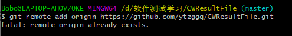

1、创建本地文件夹CWResultFile

2、奖励本地仓库

（1） 首先进入CWResultFile

（2）执行指令进行初始化，会在原始文件夹中生成一个隐藏的文件夹.git：

（3）执行指令将文件添加到本地仓库：  

建议再这个地方先pull代码先，再增加上去

    $ git add .         //添加当前文件夹下的所有文件
    $ git add **.cpp    //添加当前文件夹下的**.cpp这个文件

（4）输入本次的提交说明，准备提交暂存区中的更改的已跟踪文件，单引号内为说明内容：

​    $ git commit -m "layout"  //引号中的内容为对该文件的描述

##### 3、关联github仓库

（1）在github中新建一个repository，复制仓库地址：

https://github.com/ytzggq/CWResultFile.git

（2）执行命令：

   //新建一个repository时会出现下面的代码，直接复制即可
   $ git remote add origin https://github.com/ytzggq/CWResultFile.git

（3）**注意：**

如果出现错误：fatal: remote origin already exists，则执行以下语句：

（4）    $ git remote rm origin

再重新执行：

（5）   $ git remote add origin https://github.com/ytzggq/CWResultFile.git

即可成功。

最后执行命令：

  （6）  $ git push origin master

如果出现错误failed to push som refs to…….，则执行以下语句，先把远程服务器github上面的文件拉先来，再push 上去。：

   $ git pull origin master

刷新github，即可看到上传的文件夹。

注意，我的这个出错。

原因是因为push代码时候，要登陆，但是我登陆的账号和密码是：

463101149@qq.com ,密码：tang@369

但是后来还有提示用户名输入。我还是输入了463101149@qq.com ；

所以各种错误出现，还出现以下这个错误：

Please make sure you have the correct access rights
and the repository exists.

（7）因此需要重新设置为正确的ytzggq：输入以下命令

`git config --global user.name "ytzggq"`

然后再push

  $ git pull origin master

但是就会出现这个（被拒绝)问题，所以在remote add后不要着急git add，一定要git pull origin master，出现这个原因

是因为你在码云创建的仓库有ReadMe文件，而本地没有，造成本地和远程的不同步，
那么有**两种方案**可以解决：
**one ：**
本地没有ReadMe文件，那么就在本地生成一个：

git pull --rebase origin master    // 本地生成ReadMe文件
git push origin master

**two：**
那我就强制上传覆盖远程文件，
git push -f origin master
s://blog.csdn.net/Mrchai521/article/details/98470560